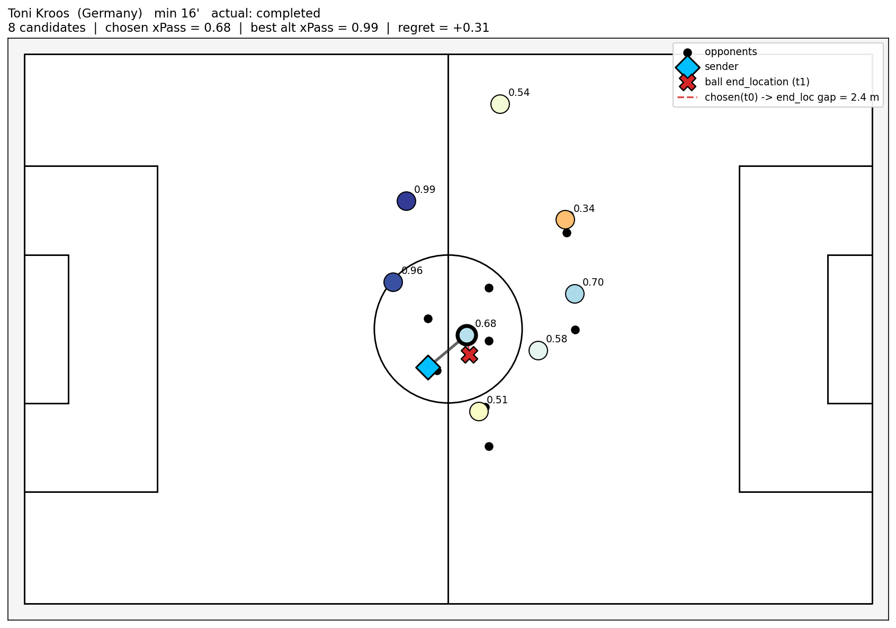
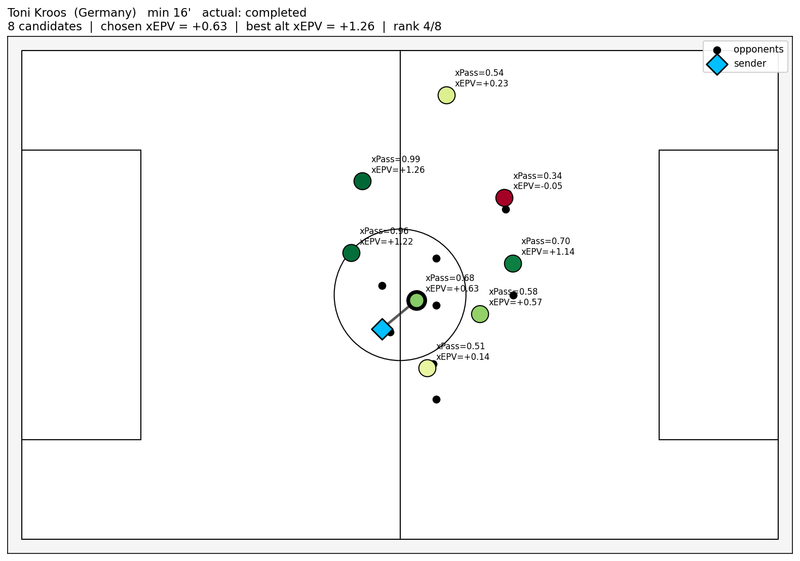
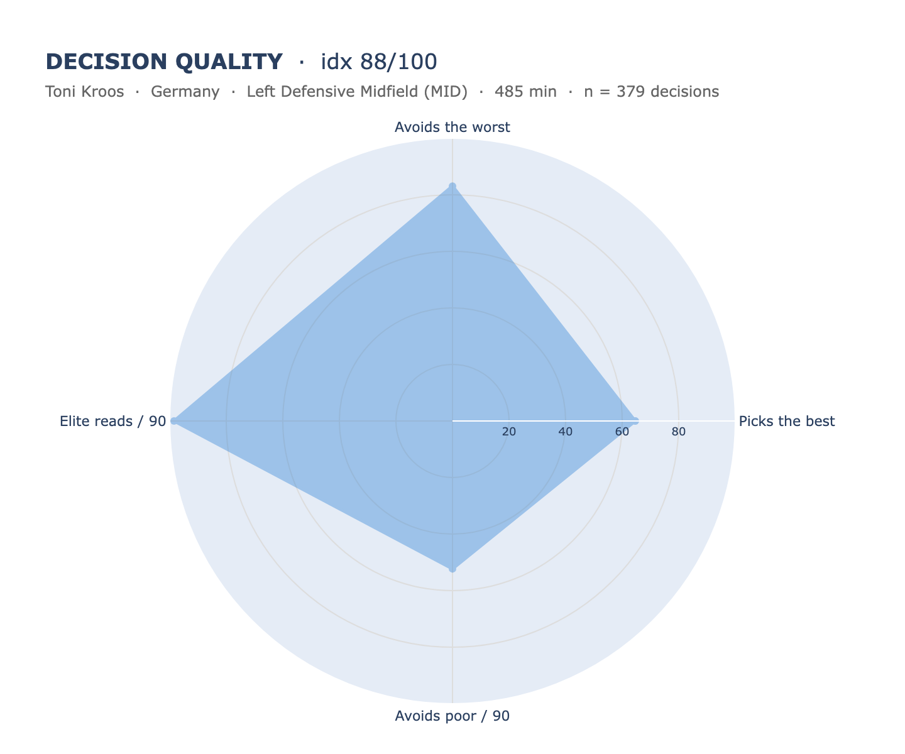

# H2 — Decision Quality

Part of **[Contextual Football Scouting](../README.md)** (Vezzoli & Mio, 2026). For the full framing of the four hypotheses see [`docs/Project_Proposal.pdf`](../docs/Project_Proposal.pdf).

Implementation of **Hypothesis 2**: a player's quality is measurable through *how well they choose* among the passing options actually available to them. Not the value of the pass they played, but its value **relative to the options they ignored**.

Built on **StatsBomb 360 open data** for UEFA Euro 2024 (`competition_id=55`, `season_id=282`, 51 matches, 272 players after the minutes filter, the same pool as H1).

## The index

For every open-play pass we reconstruct the **alternative set**: every in-frame teammate the player *could* have passed to. Each candidate is scored on two layers:

- **xPass** — `P(complete | sender, target, freeze frame)`, a calibrated GBM trained on 30,913 events (5-fold GroupKFold by match, AUC ≈ 0.92).
- **xEPV** — the expected net possession value of attempting that pass:

  `xEPV(target) = xPass · EPV(target) − (1 − xPass) · EPV(105 − target_x, target_y)`

  (reward if it arrives, mirrored opponent value if it is lost; symmetric 1:1 weighting).

Quick glossary: **freeze frame** = the StatsBomb 360 snapshot of visible players at the instant of release; **alternative set** = every in-frame teammate the player *could* have passed to in that frame; **calibrated GBM** = HistGradientBoostingClassifier wrapped in a Platt sigmoid calibrator and clipped to [0.05, 0.99]; **EPV** = probability of scoring in the next actions given the ball location.

#### One event, two layers

The same Kroos event (Germany vs Scotland, the Euro 2024 opener, min 16') shown twice. On the left the eight in-frame candidates are coloured by **xPass** (red = low completion probability, blue = high). On the right the same eight candidates are coloured by **xEPV** (red = negative net value, green = positive), and the ranking changes: a medium-probability candidate in an advanced zone can beat a near-certain pass in a low-value zone, because xEPV multiplies the probability by the destination EPV and subtracts the mirrored failure cost.




In this frame Kroos picks the candidate with chosen xPass = 0.68 (rank 5/8 on completion probability), which has xEPV = +0.63 (rank 4/8 on value). The best alternative on xEPV is the one at the top of the frame at xEPV = +1.26, a more vertical option Kroos did not take.

The headline number is **`DQ_index`**:

> Per event, **Score** = the share of the in-frame alternatives whose xEPV is at or below the xEPV of the pass the player actually chose (events with ≥ 2 alternatives). The player Score is the mean over their events. **`DQ_index` is the within macro-role percentile of that Score** (a CB is benchmarked against other CBs).

A within-event rank cancels the pitch-zone value level and does not punish players who operate where many options are valuable. That is the reason a regret-vs-best aggregation was tested and **rejected**.

**Companion:** **Value Impact** = mean `xEPV(chosen) − mean(xEPV alternatives)`, the value-weighted view of the same signal (the role `epv_added` plays in H1).

### Website graphic: the 4-axis radar

The card on the site mirrors the H1 family-card pattern: a magnitude headline next to a within-role percentile radar that decomposes the *profile* behind it. H1's Dangerousness uses `EPV Added /90` as headline and decomposes it spatially (per pitch zone); H2 uses `DQ_index` as headline and decomposes it **behaviourally** along four axes (each `100 − percentile` for the two "negative" raw metrics, so outside is always better):

- **Picks the best** ← `accuracy_pct` — rate of in-frame value-optimal picks
- **Avoids the worst** ← `worst_choice_pct` (mirrored) — rate of in-frame value-bottom picks
- **Elite reads / 90** ← `elite_per90` — volume of top-decile decisions per 90'
- **Avoids poor / 90** ← `poor_per90` (mirrored) — volume of bottom-decile decisions per 90'

The single-player page renders one filled polygon; the two-player comparison page overlays two polygons (same macro-role only, the picker prevents cross-role duels upstream). Plotly chrome and tick configuration are identical to H1's `dashboard.player_profile` / `head_to_head` panels. A **CORE STATS table** under the radar exposes the eight raw scout-facing values from the CSV (Score, Value Impact ×100, the four radar sources in raw units, Avg miss cost ×100, and n_decisions with minutes).



Kroos sits at the 88th percentile among MIDs on 379 decision events over 485 minutes. The radar reads at a glance as the metronome profile: high `Elite reads / 90` (volume of top-decile picks), strong `Avoids the worst` (rarely chooses the value-bottom alternative), solid `Picks the best`, more modest on `Avoids poor / 90` because the per-90 rate of bottom-decile decisions also carries his involvement volume.

## Pipeline

```
H1 hull_events_lb.csv + StatsBomb 360 frames
        │
        ▼   Notebook 1 — H2-Contextual_Decision_Making.ipynb
  Corpus construction      ──►  dq_corpus.csv          (30,913 events)
        │                       header / GK / into-space / no-frame filters
        ▼
  Feature engineering      ──►  xpass_features.parquet (13 model columns)
        │
        ▼
  xPass model              ──►  xpass_model_gbm_sigmoid.joblib
        │                       (GBM + sigmoid calibrator, AUC ≈ 0.92)
        ▼
  Alternatives table       ──►  alternatives.parquet   (222,274 rows, ~7.2/event)
        │
        ▼   Notebook 2 — H2-xEPV_and_Decision_Quality.ipynb
  xEPV per candidate            (xPass × EPV grid, mirrored turnover term)
        │
        ▼
  Decision Quality index   ──►  player_decision_quality.csv
        │                       (DQ_index + Value Impact + 4 radar sources
        │                        + raw / per-90 / % block — 15 columns)
        ▼
  Website graphic               4-axis radar (single + h2h overlay)
        │                       + CORE STATS table (8 rows)
        ▼
  Validation                    robustness + construct + face validity
```

The split is deliberate: **xPass** is a supervised model (training, CV, calibration, SHAP) refit rarely; `alternatives.parquet` is the clean hand-off artefact; the **value / decision layer iterates fast** on top of it without re-running the ML.

## Key findings

**Robustness.** The player ordering is refit under every arbitrary knob and compared to the shipped index by rank Spearman.

| Knob moved | Range tested | Rank Spearman vs shipped |
|---|---|---:|
| `XEPV_FAILURE_SCALE` (turnover weight) | 0.5 → 1.25 | **≥ 0.95** (min 0.957) |
| Minutes floor | 135 → 300 | **≥ 0.97** |
| `MIN_ALTERNATIVES` | 2 → 4 | **≥ 0.95** (min 0.956) |

Each knob moves the *level* of the index, not the *ranking*. The 1:1 turnover weight is a modelling choice, not a ranking choice. `DQ_index` ↔ `n_decisions` ρ ≈ −0.02 (n.s.): the index is **not** an involvement-volume proxy.

**Construct validity** (within-role Spearman, mean across the 6 macro-role pools, n = 272)

| Pair | mean ρ | Reading |
|---|---:|---|
| `DQ_index` ↔ Value Impact | **0.68** | strong → Value is the value-weighted companion, not an independent axis |
| Picks the best % ↔ Worst-choice % | **−0.06** | negligible → finding the top option and avoiding the bottom one are distinct skills; both live on the radar as separate axes |
| Picks the best % ↔ Elite reads / 90 | 0.52 | moderate (rate vs volume of "elite picks" — share a behavioural component but live at different scales) |
| Worst-choice % ↔ Poor reads / 90 | 0.33 | moderate (rate vs volume of "poor picks") |

The radar's 4 axes are **not orthogonal**: the rate-vs-volume mirrors (picks-best ↔ elite/90; worst-choice ↔ poor/90) share a behavioural component by construction. They stay as separate axes because they carry **different scaling information** (in-frame rate vs role-benchmarked volume per 90'). All four archetype quadrants on the picks-best × avoids-worst plane are populated in every macro-role.

**Face validity.** Recognised passers land high-to-upper-mid in their role (Kroos ≈ 88th percentile, De Bruyne ≈ 85th, Gündoğan ≈ 70th, Foden ≈ 68th, Rodri ≈ 65th). Tempo controllers (Modrić, Xhaka, Barella, Kimmich) sit lower. This is a **declared scope limit**, not a defect: xEPV is a per-pass quantity with no game state, so deliberate tempo control reads as "safe" by selection style. Read the top percentiles together with `n_decisions`.

**Scouting reads.** Putting `DQ_index` next to H1's `EPV Added /90` splits Euro 2024 in two groups that the volume view alone would never separate.

### Hidden decision-makers — players surfaced by selection quality

Low value-generation volume for the role (deep position, few minutes, defensive job), but in-frame selection among the best of their position.

- **Pedrí** (Spain, CAM). DQ 95th, role-EPV 35th. Not the loudest passer of the tournament, but the one who most consistently picks the best option his frame is showing him.
- **Marin Pongračić** (Croatia, CB) and **Nacho Fernández** (Spain, CB). Top of their role for selection (DQ ≥ 98th) and bottom for EPV volume (≤ 15th). Centre-backs whose in-frame choice quality is invisible to a metric that rewards final-third progressors.
- **Manuel Akanji** (Switzerland, CB, n=218). Same pattern but on a much larger sample: DQ 75th, EPV 21st.
- **Mario Mitaj** (Albania, FB), **Andrei Rațiu** (Romania, FB). Small-nation full-backs whose role-level selection quality the volume metrics had never surfaced.

### Volume overrated — players inflated by EPV volume

Top-of-role value generation per 90, but in-frame selection below the role median.

- **Joshua Kimmich** (Germany, FB). Role-EPV 96th, DQ 10th (n=256). The cleanest case in the data: his volume comes from being permanently on the ball in advanced areas, while his per-event selection sits at the bottom of full-backs. Read together with the Face validity caveat above (xEPV does not credit tempo control).
- **Trent Alexander-Arnold** (England, MID). Role-EPV 100th, DQ 20th (n=60). The interesting one across hypotheses: H1 surfaced him as a top progressor thanks to context (a lot of EPV generated from deep), H2 says his per-event in-frame selections still sit below the MID median when measured by pure value-optimality.
- **Antonio Rüdiger** (Germany, CB). Role-EPV 100th, DQ 16th (n=269). High volume, but not from picking the best option in front of him.

DQ_index and EPV-Added rank tell different stories about the same player. Read together they are the H1 + H2 product: one number for how much value the player generated, one for how well he chose to generate it. The card on the site shows both at once on purpose; the two notebooks walk the full path from the xPass model and its calibration to the radar on every player of the pool and the validation tables.

## Folder structure

```
Decision_Quality/
├── README.md
├── requirements.txt
├── .gitignore
│
├── notebooks/
│   ├── H2-Contextual_Decision_Making.ipynb     # xPass model + alternatives table
│   └── H2-xEPV_and_Decision_Quality.ipynb      # xEPV + DQ index + validation
│
├── docs/figures/                                # images used by this README
│
├── data/                                        # pipeline inputs and outputs
│   ├── dq_corpus.csv                            # H2 working corpus (30,913 events)
│   ├── alternatives.parquet                     # hand-off artefact (222,274 rows)
│   ├── player_decision_quality.csv              # final output (DQ_index + context)
│   ├── xpass_features.parquet                   # model columns (gitignored, regenerable)
│   ├── *.joblib                                 # calibrated model (gitignored)
│   └── cache/                                   # StatsBomb 360-frame cache (gitignored)
│
└── src/
    ├── config.py            # paths, thresholds, role maps (H1 constants inlined)
    ├── geometry.py          # geometric helpers (mirrored from H1)
    ├── corpus.py            # → dq_corpus.csv
    ├── features.py          # 13-column feature row per pass
    ├── xpass.py             # train / CV / calibrate / SHAP → xPass model
    ├── xepv.py              # xEPV formula (one definition, one place)
    ├── decision_quality.py  # Score → DQ_index within-role percentile
    ├── validation.py        # robustness + construct + face validity
    └── viz.py               # pitch plots + the website page graphic (radar, single + h2h)
```

## Quick start

```bash
git clone https://github.com/ArMat-Analytics/Contextual-Football-Scouting
cd Contextual-Football-Scouting/Decision_Quality
python -m venv .venv && source .venv/bin/activate
pip install -r requirements.txt

# 1. xPass model + alternatives table (heavy: trains the model)
jupyter notebook notebooks/H2-Contextual_Decision_Making.ipynb
# 2. xEPV + Decision Quality index + validation
jupyter notebook notebooks/H2-xEPV_and_Decision_Quality.ipynb
```

`dq_corpus.csv`, `alternatives.parquet` and `player_decision_quality.csv` are committed for the **analysis-only path**: you can open the second notebook and jump straight to the index design / validation cells without re-running the xPass training in the first. The notebooks are thin orchestrators, all logic lives in `src/`.

## Conventions

- **Coordinates**: pitch in meters (105 × 68, UEFA standard), attack to the right. StatsBomb yard coordinates converted via `X_SCALE = 105/120`, `Y_SCALE = 68/80`, identical to H1.
- **Pool**: H1's 272 players (≥ 135 minutes, one authoritative macro-role per player from `player_space_control_aggregated.csv`). No minimum pass count, so the H2 pool equals the H1 pool exactly.
- **Within-role percentiles**: `DQ_index` is the player's percentile rank inside their macro-role (CB / FB / MID / CAM / WIDE / FW). It is the only percentile in the file, by design.
- **Corpus filters**: open play only. Headers, goalkeeper senders and pass-into-space (no in-frame teammate within 12 m of the end location) are excluded, the xPass model never sees them.
- **xEPV failure scale**: `XEPV_FAILURE_SCALE = 1.0` (symmetric mirror penalty). The robustness table shows it sets the level, not the ranking.
- **Radar axes**: all four oriented so **outside is better**. The two "negative" raw metrics (`worst_choice_pct`, `poor_per90`) are rendered as `100 − within-role percentile`. The CORE STATS table below the radar shows the **raw CSV values verbatim**, not the mirrored ones, same pattern as H1 (mirror on the radar, raw in the table).

---

*Matteo Vezzoli & Armando Mio — 2026*
