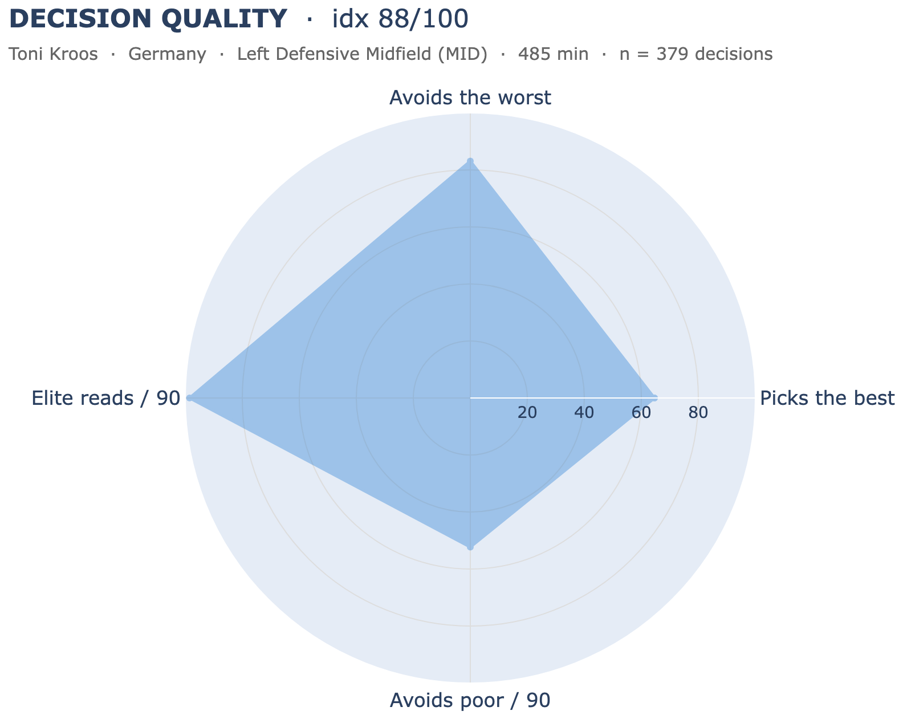

# H2 — Decision Quality

Part of **[Contextual Football Scouting](../README.md)** (Vezzoli & Mio, 2026). For the full framing of the four hypotheses see [`docs/Project_Proposal.pdf`](../docs/Project_Proposal.pdf).

Implementation of **Hypothesis 2**: a player's quality is measurable through *how well they choose* among the passing options actually available to them. Not the value of the pass they played, but its value **relative to the options they ignored**.

Built on **StatsBomb 360 open data** for UEFA Euro 2024 (`competition_id=55`, `season_id=282`, 51 matches, 272 players after the minutes filter, the same pool as H1).

## The index

For every open-play pass we reconstruct the **alternative set**: every in-frame teammate the player *could* have passed to. Each candidate is scored on two layers:

- **xPass** — `P(complete | sender, target, freeze frame)`, a calibrated GBM trained on 30,913 events (5-fold GroupKFold by match, AUC ≈ 0.92).
- **xEPV** — the expected net possession value of attempting that pass:

  `xEPV(target) = xPass · EPV(target) − (1 − xPass) · EPV(105 − target_x, target_y)`

  (reward if it arrives, mirrored opponent value if it is lost; symmetric 1:1 weighting).

Quick glossary: **freeze frame** = the StatsBomb 360 snapshot of visible players at the instant of release; **alternative set** = every in-frame teammate the player *could* have passed to in that frame; **calibrated GBM** = HistGradientBoostingClassifier wrapped in a Platt sigmoid calibrator and clipped to [0.05, 0.99]; **EPV** = probability of scoring in the next actions given the ball location.

#### One event, two layers

The same Kroos event (Germany vs Scotland, the Euro 2024 opener, min 16') shown twice. On the left the eight in-frame candidates are coloured by **xPass** (red = low completion probability, blue = high). On the right the same eight candidates are coloured by **xEPV** (red = negative net value, green = positive), and the ranking changes: a medium-probability candidate in an advanced zone can beat a near-certain pass in a low-value zone, because xEPV multiplies the probability by the destination EPV and subtracts the mirrored failure cost.


In this frame Kroos picks the candidate with chosen xPass = 0.68 (rank 5/8 on completion probability), which has xEPV = +0.63 (rank 4/8 on value). The best alternative on xEPV is the one at the top of the frame at xEPV = +1.26, a more vertical option Kroos did not take.

The headline number is **`DQ_index`**:

> Per event, **Score** = the share of the in-frame alternatives whose xEPV is at or below the xEPV of the pass the player actually chose (events with ≥ 2 alternatives). The player Score is the mean over their events. **`DQ_index` is the within macro-role percentile of that Score** (a CB is benchmarked against other CBs).

A within-event rank cancels the pitch-zone value level and does not punish players who operate where many options are valuable. That is the reason a regret-vs-best aggregation was tested and **rejected**.

**Companion:** **Value Impact** = mean `xEPV(chosen) − mean(xEPV alternatives)`, the value-weighted view of the same signal (the role `epv_added` plays in H1).

H2's metrics are built to sit next to H1's four families on the same player card. The natural pairing on the card is with DANGEROUSNESS (whose headline is `EPV Added /90`), because H2 measures how well a player chose the passes that built that EPV.

### Website graphic: the 4-axis radar

The card on the site mirrors the H1 family-card pattern: a magnitude headline next to a within-role percentile radar that decomposes the *profile* behind it. H1's Dangerousness uses `EPV Added /90` as headline and decomposes it spatially (per pitch zone); H2 uses `DQ_index` as headline and decomposes it **behaviourally** along four axes (each `100 − percentile` for the two "negative" raw metrics, so outside is always better):

- **Picks the best** ← `accuracy_pct` — rate of in-frame value-optimal picks
- **Avoids the worst** ← `worst_choice_pct` (mirrored) — rate of in-frame value-bottom picks
- **Elite reads / 90** ← `elite_per90` — volume of top-decile decisions per 90'
- **Avoids poor / 90** ← `poor_per90` (mirrored) — volume of bottom-decile decisions per 90'

The single-player page renders one filled polygon; the two-player comparison page overlays two polygons (same macro-role only, the picker prevents cross-role duels upstream). Plotly chrome and tick configuration are identical to H1's `dashboard.player_profile` / `head_to_head` panels. A **CORE STATS table** under the radar exposes the eight raw scout-facing values from the CSV (Score, Value Impact ×100, the four radar sources in raw units, Avg miss cost ×100, and n_decisions with minutes).



Kroos sits at the 88th percentile among MIDs on 379 decision events over 485 minutes. The radar reads at a glance as the metronome profile: high `Elite reads / 90` (volume of top-decile picks), strong `Avoids the worst` (rarely chooses the value-bottom alternative), solid `Picks the best`, more modest on `Avoids poor / 90` because the per-90 rate of bottom-decile decisions also carries his involvement volume.

## Pipeline

```
H1 hull_events_lb.csv + StatsBomb 360 frames
        │
        ▼   Notebook 1 — H2-Contextual_Decision_Making.ipynb
  Corpus construction      ──►  dq_corpus.csv          (30,913 events)
        │                       header / GK / into-space / no-frame filters
        ▼
  Feature engineering      ──►  xpass_features.parquet (13 model columns)
        │
        ▼
  xPass model              ──►  xpass_model_gbm_sigmoid.joblib
        │                       (GBM + sigmoid calibrator, AUC ≈ 0.92)
        ▼
  Alternatives table       ──►  alternatives.parquet   (222,274 rows, ~7.2/event)
        │
        ▼   Notebook 2 — H2-xEPV_and_Decision_Quality.ipynb
  xEPV per candidate            (xPass × EPV grid, mirrored turnover term)
        │
        ▼
  Decision Quality index   ──►  player_decision_quality.csv
        │                       (DQ_index + Value Impact + 4 radar sources
        │                        + raw / per-90 / % block — 15 columns)
        ▼
  Website graphic               4-axis radar (single + h2h overlay)
        │                       + CORE STATS table (8 rows)
        ▼
  Validation                    robustness + construct + face validity
```

The split is deliberate: **xPass** is a supervised model (training, CV, calibration, SHAP) refit rarely; `alternatives.parquet` is the clean hand-off artefact; the **value / decision layer iterates fast** on top of it without re-running the ML.

## Key findings

A scout-first read of the Euro 2024 leaderboard on `DQ_index` and the four radar axes. Numbers below are read on the display pool (`n_decisions ≥ 40`), so a small-sample player who appears as 100th is meaningful but his volume context is still in the table.

### Confirmations — recognised passers land where football expects

- **Pedrí** (Spain, CAM) — DQ 95th. The clearest "pure selector" of the tournament: not the loudest passer, but the one who consistently picks the best option his frame offers.
- **Toni Kroos** (Germany, MID, n=379) — DQ 88th. On the largest sample of any midfielder, with 10.6 elite reads / 90 and only 4 worst-choice events out of every 100.
- **Kevin De Bruyne** (Belgium, CAM, n=136) — DQ 85th. Highest `Picks the best %` of the watchlist at 17.6%.
- **Mateo Kovačić** (Croatia, MID) — DQ 82nd. Reads above his reputation in this metric.
- **İlkay Gündoğan** (Germany, CAM) — DQ 70th.
- **Phil Foden** (England, WIDE) and **Rodri** (Spain, MID) — both upper-mid in their role at 68th and 65th.

### Surprises — names the volume view never surfaces

Lesser-known players with `DQ_index ≥ 90` on a meaningful sample (`n ≥ 40`). The radar at this level reads as "consistently picks the best option in-frame given the role pool", not "loudest passer".

- **Răzvan Marin** (Romania, MID, n=68) — DQ 98th, `Picks the best %` 27.9% and `Avoids the worst` 7.4%. Both very high in his role.
- **Nacho Fernández** (Spain, CB, n=86) — DQ 98th, n large enough to take seriously. The Spain back-line is one of the discoveries of the tournament on this metric.
- **Marin Pongračić** (Croatia, CB), **Jack Hendry** (Scotland, CB), **Jakub Kiwior** (Poland, CB), **Jan Bednarek** (Poland, CB) — a cluster of central defenders sitting at the very top of their role pool on selection quality.
- **Mario Mitaj** (Albania, FB), **Andrei Rațiu** (Romania, FB), **Otar Kakabadze** (Georgia, FB), **Anthony Ralston** (Scotland, FB) — four full-backs at DQ ≥ 93 on small but real samples. Otar Kakabadze in particular shows the highest `Picks the best %` of the surprises group (30%).
- **Cody Gakpo** (Netherlands, WIDE, n=83) — DQ 95th, `Picks the best %` 30.1%. A familiar name but the radar reads higher than the volume metrics suggest.
- **Piotr Zieliński** (Poland, MID), **Joey Veerman** (Netherlands, MID), **Giorgi Kochorashvili** (Georgia, MID) — three midfielders at DQ 94–97 on samples of n ≥ 97, the most solid surprises of the MID pool.

### Big names that don't measure up

Famous passers whose `DQ_index` is lower than the public reputation. Two distinct reasons in the data; the README is honest about both.

- **Joshua Kimmich** (Germany, FB, n=256) — DQ 10th. The lowest of the famous watchlist by a margin. High `Worst-choice %` 7.4 and high `Poor reads / 90` 5.2 on a very large sample.
- **Nicolò Barella** (Italy, MID, n=193) — DQ 12th, `Picks the best %` only 7.3.
- **Granit Xhaka** (Switzerland, MID, n=296) — DQ 40th. Reads as mid-pack, with `Poor reads / 90` 7.0 weighing down the index.
- **Luka Modrić** (Croatia, MID, n=169) — DQ 45th. The most counter-intuitive low of the four.
- **Declan Rice** (England), **Jude Bellingham** (England), **Bernardo Silva** (Portugal) — all upper-mid (50–55), not low but below the public expectation.

Kimmich and Modrić in particular look harsh and need the Face validity caveat below: Kimmich, Modrić, Xhaka and Barella all play with deliberate tempo control, and `xEPV` is a per-pass quantity with no game state, so deliberate tempo reads as "safe" by selection style. The metric does not see that. The gap is the lens, not necessarily the player.

### Face validity

The five recognised passers — Kroos, De Bruyne, Gündoğan, Foden, Rodri — land 65th–88th, with no surprises in their direction. The known tempo controllers (Kimmich, Barella, Xhaka, Modrić) sit below the role median: a **declared scope limit**, not a defect. Always read the top percentiles together with `n_decisions`: a 100th at n = 44 (Ralston) is a different claim than 88th at n = 379 (Kroos).

The numerical machinery behind the index — rank robustness across the arbitrary knobs (`XEPV_FAILURE_SCALE`, minutes floor, `MIN_ALTERNATIVES`) and the within-role correlation matrix of the radar axes — is in [`src/validation.py`](src/validation.py), reproduced in the second notebook. The H2 pool stays the full 272 players from H1; the `n_decisions ≥ 40` filter is display-only.

## Folder structure

```
H2_Decision_Quality/
├── README.md
├── requirements.txt
├── .gitignore
│
├── notebooks/
│   ├── H2-Contextual_Decision_Making.ipynb     # xPass model + alternatives table
│   └── H2-xEPV_and_Decision_Quality.ipynb      # xEPV + DQ index + validation
│
├── docs/figures/                                # images used by this README
│
├── data/                                        # pipeline inputs and outputs
│   ├── dq_corpus.csv                            # H2 working corpus (30,913 events)
│   ├── alternatives.parquet                     # hand-off artefact (222,274 rows)
│   ├── player_decision_quality.csv              # final output (DQ_index + context)
│   ├── xpass_features.parquet                   # model columns (gitignored, regenerable)
│   ├── *.joblib                                 # calibrated model (gitignored)
│   └── cache/                                   # StatsBomb 360-frame cache (gitignored)
│
└── src/
    ├── config.py            # paths, thresholds, role maps (H1 constants inlined)
    ├── geometry.py          # geometric helpers (mirrored from H1)
    ├── corpus.py            # → dq_corpus.csv
    ├── features.py          # 13-column feature row per pass
    ├── xpass.py             # train / CV / calibrate / SHAP → xPass model
    ├── xepv.py              # xEPV formula (one definition, one place)
    ├── decision_quality.py  # Score → DQ_index within-role percentile
    ├── validation.py        # robustness + construct + face validity
    └── viz.py               # pitch plots + the website page graphic (radar, single + h2h)
```

## Quick start

```bash
git clone https://github.com/ArMat-Analytics/Contextual-Football-Scouting
cd Contextual-Football-Scouting/H2_Decision_Quality
python -m venv .venv && source .venv/bin/activate
pip install -r requirements.txt

# 1. xPass model + alternatives table (heavy: trains the model)
jupyter notebook notebooks/H2-Contextual_Decision_Making.ipynb
# 2. xEPV + Decision Quality index + validation
jupyter notebook notebooks/H2-xEPV_and_Decision_Quality.ipynb
```

`dq_corpus.csv`, `alternatives.parquet` and `player_decision_quality.csv` are committed for the **analysis-only path**: you can open the second notebook and jump straight to the index design / validation cells without re-running the xPass training in the first. The notebooks are thin orchestrators, all logic lives in `src/`.

## Conventions

- **Coordinates**: pitch in meters (105 × 68, UEFA standard), attack to the right. StatsBomb yard coordinates converted via `X_SCALE = 105/120`, `Y_SCALE = 68/80`, identical to H1.
- **Pool**: H1's 272 players (≥ 135 minutes, one authoritative macro-role per player from `player_space_control_aggregated.csv`). No minimum pass count, so the H2 pool equals the H1 pool exactly.
- **Within-role percentiles**: `DQ_index` is the player's percentile rank inside their macro-role (CB / FB / MID / CAM / WIDE / FW). It is the only percentile in the file, by design.
- **Corpus filters**: open play only. Headers, goalkeeper senders and pass-into-space (no in-frame teammate within 12 m of the end location) are excluded, the xPass model never sees them.
- **xEPV failure scale**: `XEPV_FAILURE_SCALE = 1.0` (symmetric mirror penalty). The robustness table shows it sets the level, not the ranking.
- **Radar axes**: all four oriented so **outside is better**. The two "negative" raw metrics (`worst_choice_pct`, `poor_per90`) are rendered as `100 − within-role percentile`. The CORE STATS table below the radar shows the **raw CSV values verbatim**, not the mirrored ones, same pattern as H1 (mirror on the radar, raw in the table).

---

*Matteo Vezzoli & Armando Mio — 2026*
