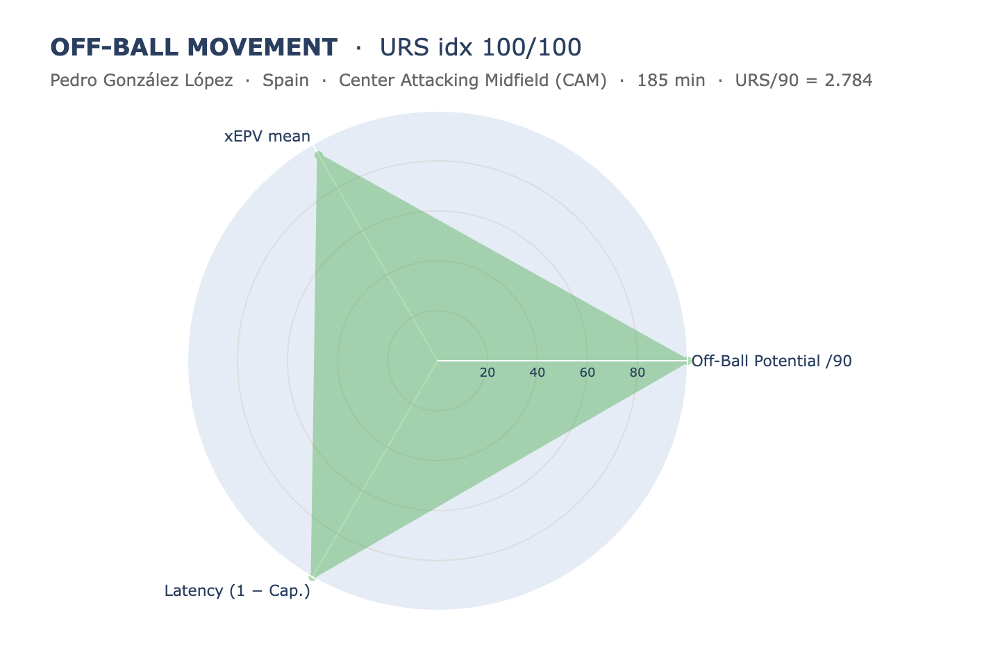
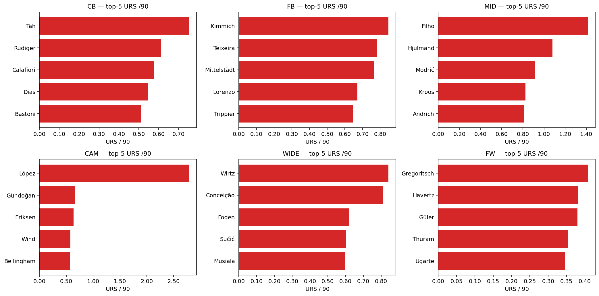
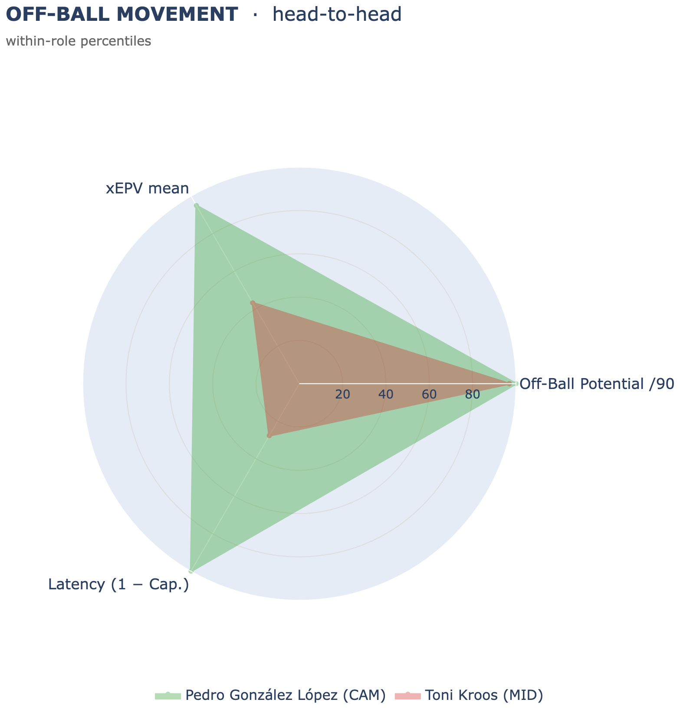
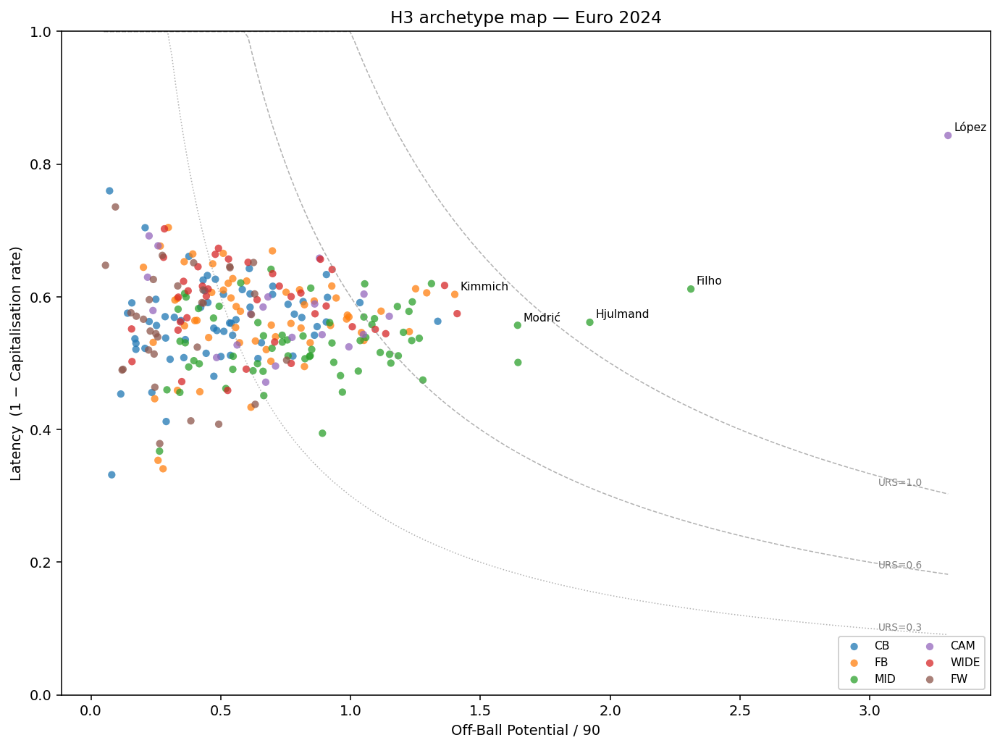

# H3 — Off-Ball Movement

Part of **[Contextual Football Scouting](../README.md)** (Vezzoli & Mio, 2026). For the full framing of the four hypotheses see [`docs/Project_Proposal.pdf`](../docs/Project_Proposal.pdf).

Implementation of **Hypothesis 3**: most of a player's game happens *without the ball*, and the value of that work is invisible to event data. We measure the **dangerous off-ball space a player occupies that his teammates fail to use**: the high-value runs that are made, seen by the freeze frame, and left unserved.

Built on **StatsBomb 360 open data** for UEFA Euro 2024 (`competition_id=55`, `season_id=282`, 51 matches, 272 players after the minutes filter, the same pool as H1 and H2).

## The index

While a teammate has the ball, every other visible teammate is a *candidate target*: a player the ball-carrier could have served. For each candidate we ask two questions.

- **How much would that pass have been worth?** We score it with **xEPV**, the exact calibrated quantity from H2, read from the receiver's side:

  `xEPV(target) = xPass · EPV(target) − (1 − xPass) · EPV(105 − target_x, target_y)`

  (value if the pass arrives, mirrored opponent value if it is lost; symmetric 1:1 weighting, `XEPV_FAILURE_SCALE = 1.0` inherited from H2).

- **Was the run actually served?** A candidate is **received** if the next ball-touch within 4 seconds belongs to him.

The value a player offers but does not get is the *uncapitalised* part. Summed per player and normalised per 90 minutes, it is the headline:

> **URS /90** (Uncapitalized Run Score) `= Σ xEPV · (1 − received) / minutes × 90`: the latent off-ball value the player generated that teammates left on the table. **The headline rating is its within macro-role percentile** (a full-back is benchmarked against other full-backs).

Quick glossary: **freeze frame** = the StatsBomb 360 snapshot of visible players at the instant the pass is released; **candidate** = a visible teammate (not the carrier, not a goalkeeper) treated as a hypothetical pass target; **confident** = a candidate whose identity the resolver localised within 8 m, the only ones scored; **received** = served by the next touch within 4 s.

URS factors cleanly into its two halves, which are the radar axes:

```
URS /90  =  Off-Ball Potential /90  ×  Latency
            (how much value he exposes)   (the share left unserved)
```

A player with high Potential **and** high Latency is a **shadow runner**: he keeps offering dangerous options his team does not use. A player with high Potential and low Latency is a **trusted threat**: he offers as much, and his team uses it. URS rewards the first, which is the behaviour H3 is built to surface.

### The receiver resolver — the part that makes H3 possible

A 360 freeze frame gives positions but **no identity**: only the player on the ball is named, everyone else carries just a team tag. With no names, there is no off-ball player to credit. The core of H3 is a resolver that puts names on the anonymous dots:

1. **Estimate each teammate's position** at the instant of the pass by interpolating between his nearest on-ball events before and after it (bracket interpolation).
2. **Match estimates to dots** with the Hungarian algorithm (optimal one-to-one assignment minimising total distance).
3. **Keep only confident assignments**, those localised within 8 m, and score only those.

There is no ground truth for off-ball runs (nobody touches the ball, so StatsBomb records no name), but there *is* one for completed passes: the `pass_recipient`. So we validate where the truth exists and carry the result over: we hide that recipient, let the resolver predict who the receiving dot is, and check it against the real name. The assumption is that a resolver this accurate at naming the dot a pass *reaches* is just as accurate at naming the dots it *bypasses* — the off-ball candidates H3 actually scores.

On the open-play universe the metric runs on, the bracket resolver reaches **93% accuracy on the confident assignments it keeps**. The honest comparison is against the naive alternative — placing each dot at the player's *last known position* with no interpolation — which manages only ~74%. That gap is what clears the bar to rank players individually rather than only by zone.

### Website graphic: the 3-axis radar

The card mirrors the H1/H2 family pattern: a magnitude headline next to a within-role percentile radar that decomposes the *profile* behind it. H3's headline is the **URS /90 percentile**; the radar profiles it on three axes (all oriented so **outside is better**):

- **Off-Ball Potential /90** — volume × quality of off-ball exposure
- **xEPV mean** — quality of the average frame, separating few great runs from many ordinary ones
- **Latency (1 − Cap.)** — the share of offered value left uncapitalised

The single-player page renders one filled polygon; the comparison page overlays two (same macro-role only, the picker prevents cross-role duels). Plotly chrome and tick configuration are identical to H1's and H2's radars. A **Raw block** under the radar exposes the scout-facing values (URS /90, Off-Ball Potential /90, Capitalisation rate, xEPV mean) plus the sample size (confident frames, minutes), so low-sample profiles can be discounted.



Pedri sits at the 100th percentile of CAMs: maximum Off-Ball Potential, near-maximum xEPV mean, and the highest Latency of his role. The shape is the extreme shadow-runner fingerprint, a player who exposes more dangerous space than anyone and is served on barely 16% of it.

## Pipeline

```
StatsBomb 360 frames + events  (live pull)
        │
        ▼   src/candidates.py — receiver resolver
  Candidate construction   ──►  off_ball_candidates.parquet
        │                       (open-play, non-header, non-GK passes;
        │                        every confident teammate dot + on-the-fly xPass)
        ▼   src/xepv.py — H2 reused
  xEPV per candidate       ──►  off_ball_xepv.parquet
        │                       (epv_target, epv_mirror, xepv, received)
        ▼   src/urs.py
  Per-player aggregation   ──►  player_urs_aggregated.csv
        │                       (URS /90 + Potential + Capitalisation + xEPV mean
        │                        + within-role percentiles — final output)
        ▼
  Website graphic               3-axis radar (single + h2h) + Raw block
        │
        ▼
  Validation                    resolver accuracy + split-half + robustness
```

The split mirrors H2: the **xPass model is reused, never retrained**. H3 recomputes it on the fly from the live freeze frames with H2's saved `CalibratedXPass`, because StatsBomb regenerated every event UUID and a merge on H2's frozen alternatives would return nothing. Same model, same 13 features, so the value attached to each candidate is exactly what H2 would attach (median difference 0.000 on the shared events).

## Key findings

A scout-first read of the Euro 2024 leaderboard on `URS /90`. As with H1 and H2, the honest reading is **within-role**: the absolute board is midfield-heavy by construction (midfielders sit at the centre of play, appear in more frames, and operate in higher-EPV zones), so a forward is read against forwards and a centre-back against centre-backs.

### The shadow runners — high-value runs left unused

- **Pedri** (Spain, CAM, n=185') tops the whole pool at **URS /90 = 2.78**, roughly twice the next name. He exposes more off-ball value than anyone (Potential /90 = 3.30) and is served on only 16% of it: the extreme shadow runner of the tournament. The headline is striking but **fragile**: 185 minutes barely clears the floor, so read it next to the sample.
- **Jorginho** (Italy, MID, n=219') at **1.41** and **Morten Hjulmand** (Denmark, MID, n=244') at **1.08** are the recognised tempo-setters whose constant between-the-lines availability is only partly used.
- **Luka Modrić** (Croatia, MID) at **0.92**, on a profile that confirms the public reading: still offering dangerous options at 38, served less than he offers.

### Within-role tops — where football already expects them

The role pools surface the right archetypes, none of which need the index to be recognised:

- **CB** — **Tah**, **Rüdiger**, **Calafiori**, **Rúben Dias**, **Bastoni**: the ball-playing centre-backs who step out and offer themselves as a forward option, not the recyclers.
- **FB** — **Kimmich**, **Dalot**, **Mittelstädt**, **Di Lorenzo**, **Trippier**: the attacking full-backs.
- **MID** — **Jorginho**, **Hjulmand**, **Modrić**, **Kroos**, **Andrich**: the creative engine room.
- **CAM** — **Pedri**, **Gündoğan**, **Eriksen**: the between-the-lines tens.
- **WIDE** — **Wirtz**, **Conceição**, **Foden**, **Sučić**, **Musiala**: the inside-drifting forwards.
- **FW** — **Gregoritsch**, **Havertz**, **Güler**, **Thuram**, **Ugarte**.



### Trusted threat vs shadow runner — the same value, opposite outcome

The cleanest illustration of what the metric isolates is **Pedri against Kroos**. Both are near the top on Off-Ball Potential, so on the volume axis they look alike. The difference is Latency: Pedri is served on 16% of the value he offers, **Toni Kroos** (Germany, MID) on 50%. On the radar the two polygons sit on top of each other on Potential and pull apart entirely on Latency. Same exposure, opposite outcome: one is a threat his team keeps missing, the other a threat his team uses.



### Validity

**Split-half reliability.** Splitting the 51 matches by date into the first 25 and last 26, the URS /90 ranking reproduces at **Spearman ρ = 0.72** (n = 117 players who clear the floor in both blocks). A player's URS over the opening matches predicts his URS over the closing ones, so the order is a stable signal, not a single hot run.

**The three radar axes carry distinct signal.** The matrix below is the **within-role** Spearman correlation of the three axes (each metric is ranked inside its macro-role, then correlated across the pooled within-role ranks, so role-level mean differences don't inflate it). Within role the axes are positively but only weakly correlated. Off-Ball Potential and Latency are almost unrelated (ρ ≈ 0.08): how much space a player exposes is essentially independent of whether it gets used, which is why the archetype map below spreads players across two real dimensions rather than one diagonal. xEPV mean carries the most shared signal with Potential (ρ ≈ 0.56, a player who exposes more value tends to expose *better* frames too) and is weakly tied to Latency (ρ ≈ 0.15). None of the off-diagonal values is high enough to call any axis redundant — the near-zero Potential–Latency link is the strongest form of that claim.

| | Potential /90 | xEPV mean | Latency |
|---|---:|---:|---:|
| **Potential /90** | 1.00 | 0.56 | 0.08 |
| **xEPV mean** | 0.56 | 1.00 | 0.15 |
| **Latency** | 0.08 | 0.15 | 1.00 |

**A declared dependency.** Off-Ball Potential correlates with the headline at ρ ≈ 0.97 by construction (`URS = Potential × Latency`, and Potential carries the wider spread). It is kept on the radar as the most readable volume axis rather than treated as an independent signal, the same honesty H2 applies to its Value Impact companion.

**Conditional on teammate execution.** A run counts toward URS only when it is *not* served, and whether it is served depends partly on the ball-carrier, not the off-ball player alone — so part of the signal is the surrounding environment. The dependency lives in the **Latency** axis; **Off-Ball Potential** is the player-only half, and the two are nearly independent within role (ρ ≈ 0.08 above). Measured directly, the effect is real but small: a player's Latency correlates with the leave-one-out H2 Decision-Quality of his own teammates at ρ ≈ −0.13 within role (better teammates capitalise more), so URS stays predominantly a player signal. This makes URS a natural **complement to H2** — H2 grades the player as the server, URS's Latency grades how often his off-ball offers go unused by his side.



The archetype scatter reads the whole pool at once. Pedri sits alone in the top-right corner (high Potential, high Latency); Jorginho, Hjulmand and Modrić form the next cluster out to the right at a middling Latency near 0.55; most players live below Potential 1.0 with Latency in a narrow band, so the axis that moves a player out of the pack is **exposure**, not capitalisation.

## Folder structure

```
H3_Off_Ball_Movement/
├── README.md
├── requirements.txt
│
├── notebooks/
│   └── H3-Off_Ball_Movement.ipynb         # thin notebook: imports from src/ and shows results
│
├── docs/figures/                           # images used by this README
│
├── data/                                   # pipeline inputs and outputs
│   ├── off_ball_candidates.parquet         # resolver output: confident candidates + xPass
│   ├── off_ball_xepv.parquet               # + xEPV and the received flag (hand-off artefact)
│   ├── player_urs_aggregated.csv           # final output (URS /90 + radar percentiles)
│   ├── receiver_resolution_*.csv           # resolver validation (per-match + all-passes)
│   ├── calibration_W_thr.csv               # parameter sweep table
│   └── cache/                              # StatsBomb 360-frame cache (gitignored)
│
└── src/
    ├── config.py                          # paths, thresholds, role map; H1/H2 loaders (collision-safe)
    ├── candidates.py                      # receiver resolver (bracket + Hungarian) + on-the-fly xPass
    ├── xepv.py                            # H2's compute_xepv + the received flag
    ├── urs.py                             # per-player aggregation, within-role percentiles, radar, split-half
    └── validate_receiver_resolution.py    # full-tournament resolver accuracy harness
```

## Quick start

```bash
git clone https://github.com/ArMat-Analytics/Contextual-Football-Scouting
cd Contextual-Football-Scouting/H3_Off_Ball_Movement
python -m venv .venv && source .venv/bin/activate
pip install -r requirements.txt

jupyter notebook notebooks/H3-Off_Ball_Movement.ipynb
```

The notebook runs the pipeline in order: Section 0 setup, Section 1 the resolver and its calibration, Section 2 candidates, Section 3 xEPV, Section 4 the URS aggregation, then the leaderboard, within-role tops, archetype map, radar and validation. To run a single stage from the CLI:

```bash
python -m src.candidates                  # → off_ball_candidates.parquet (heavy: pulls 360 frames)
python -m src.xepv                        # → off_ball_xepv.parquet
python -m src.urs                         # → player_urs_aggregated.csv
python -m src.validate_receiver_resolution  # resolver accuracy report
```

`off_ball_candidates.parquet`, `off_ball_xepv.parquet` and `player_urs_aggregated.csv` are committed for the **analysis-only path**: you can open the notebook and jump straight to the index / radar / validation cells without re-running the resolver. H3 requires H1's `player_space_control_aggregated.csv` and H2's saved `xpass_model_gbm_sigmoid.joblib` to be present in their sibling project folders.

## Conventions

- **Coordinates**: pitch in metres (105 × 68, UEFA standard). StatsBomb yard coordinates converted via `X_SCALE = 105/120`, `Y_SCALE = 68/80`, identical to H1 and H2.
- **Open play only**: a pass is kept iff its `pass_type` is null (StatsBomb tags every set-piece restart with a non-null `pass_type`), the sender is not a goalkeeper, and it is not a header (the value is scored with H2's foot-pass xPass model). This is H1's exact open-play filter. H2's pass-into-space filter is **not** applied: H3 grades every confidently-located teammate in the frame, not the chosen pass, so a long ball still carries well-positioned candidates worth scoring.
- **Pool**: H1's 272 players (≥ 135 minutes, no goalkeepers). `macro_role` is read straight from H1's `player_space_control_aggregated.csv` (the per-event role mode), **not** re-derived from the nominal position, so the role pools match H1 and H2 exactly.
- **Within-role percentiles**: every radar axis and the headline are the player's percentile rank inside their macro-role (CB / FB / MID / CAM / WIDE / FW), `rank(pct=True) × 100`, the same recipe as H1 and H2.
- **xEPV**: H2's `compute_xepv` reused unchanged (`XEPV_FAILURE_SCALE = 1.0`). xPass is recomputed on the fly from live freeze frames with H2's saved model, never retrained.
- **Confident only**: candidates are scored only when the resolver localises them within `CONF_THR_M = 8 m`; the served window is `RECEIVED_WINDOW_S = 4 s`; the resolver staleness window is `WINDOW_SECONDS = 5 s`. All three are calibrated in the notebook's §1.4.

---

*Matteo Vezzoli & Armando Mio — 2026*
