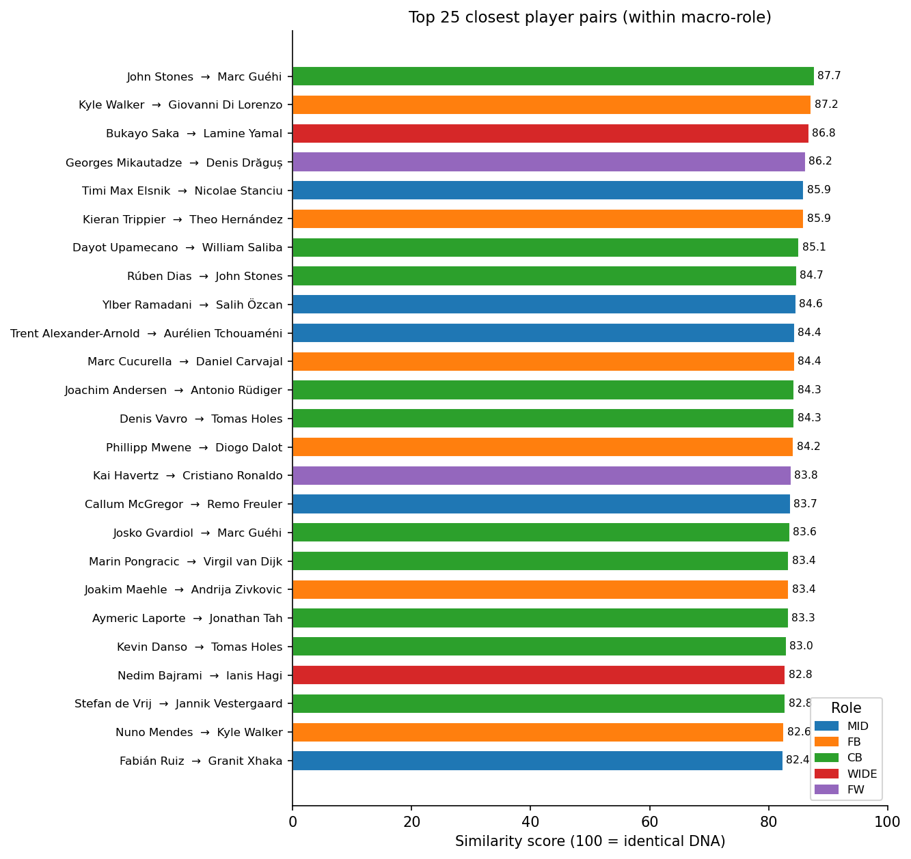
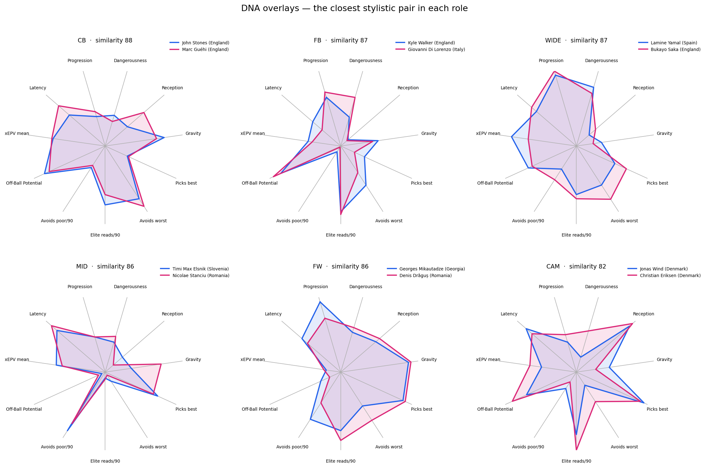
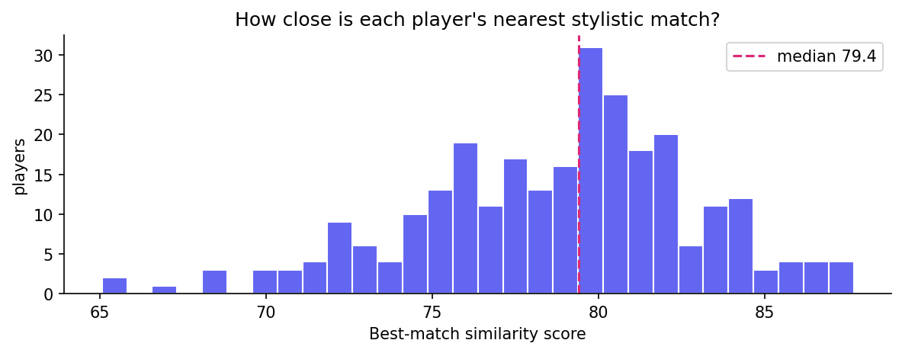
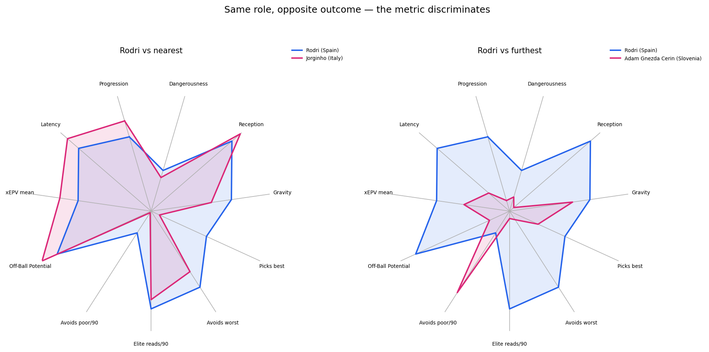

# H4 — Player Similarity

Part of **[Contextual Football Scouting](../README.md)** (Vezzoli & Mio, 2026). For the full framing of the four hypotheses see [`docs/Project_Proposal.pdf`](../docs/Project_Proposal.pdf).

Implementation of **Hypothesis 4**: players should be matched by **how they actually play, not by their position label**. Each player gets a "style DNA" assembled from the three earlier studies (H1 space control, H2 decision quality, H3 off-ball movement), and we find his closest stylistic matches **inside his own role**. This is the scouting question made concrete: *who plays like this expensive player, but costs less?*

H4 is a **meta-study**: it runs no StatsBomb pull and no heavy computation. It reads the committed output CSVs of H1, H2 and H3 (one row per player, already within-role percentiles) for the same **272-player** Euro 2024 pool, and turns them into a within-role similarity model.

## The DNA

Every player is described by **11 numbers**, his DNA. Each number is a within-role percentile (0–100) taken straight from one of the three studies' radars:

- **H1 (space):** Progression · Dangerousness · Reception · Gravity
- **H2 (decisions):** Picks best · Avoids worst · Elite reads /90 · Avoids poor /90
- **H3 (off-ball):** Off-Ball Potential · xEPV mean · Latency

> **DNA = the 11 radar axes of H1+H2+H3, each a within-role percentile.** Two players are similar when their DNA vectors sit close together; a centre-back is only ever compared with other centre-backs.

**Why these 11 and not the headline scores.** We deliberately drop the two summary ratings, H2's `DQ_index` and H3's `URS /90`, because each is a *function* of axes already in the vector (a rank, or `Potential × Latency`), so keeping them would count the same thing twice. We keep the component axes instead: they carry *how* a player decides and moves, which is exactly what "plays like X" needs.

### The similarity score

**Step 1, measure the distance.** We take the straight-line (Euclidean) distance between two DNA vectors:

`d(A,B) = sqrt( Σ (aᵢ − bᵢ)² )` over the 11 axes.

Identical DNA gives distance 0. The more the numbers differ, the larger the distance.

**Step 2, turn the distance into a 0–100 score.** A distance is hard to read, so we rescale it against the **largest distance two players could ever have**. Each axis runs 0–100, so the biggest gap on one axis is 100, and across 11 axes that is `D = sqrt(11) × 100 ≈ 331.7`:

`similarity = (1 − d / D) × 100`     (100 = identical profile, 0 = maximally different).

`D` is a **fixed** number. It comes from the *shape* of the data (11 axes, each 0–100), not from the players, so a pair's score depends only on those two players. Adding or removing anyone else never changes it. We avoid the popular min–max alternative (stretch so the closest real pair is 100% and the furthest 0%) because it is unstable, since one odd player shifts everyone's score, and because it forces a 100% and a 0% to exist even when no real pair is that close or that far. The fixed `D` gives a score that always means the same thing. The only cost is cosmetic: real scores land in the **23–88%** band, never the full 0–100, because two real footballers are never identical and never total opposites. So read 88% as *"about as alike as two players ever get here"*.

### Why re-rank every axis to a within-role percentile

Euclidean distance gives more weight to any axis that is more spread out. The H2 and H3 axes already arrive as percentiles (evenly spread 0–100), but H1's indices are composite scores with a smaller, bunched-up spread. Left alone, the H1 axes (**Gravity** worst of all) would count for far less than the others. The fix in `load_dna()` re-ranks **every** axis to a within-role percentile, so all 11 sit on one uniform 0–100 scale and each carries an equal **9.1%** of the distance. This is not just tidying. Without it Gravity carries only **3.7%** instead of 9.1%, enough to flip the single closest match for **26%** of players.

## Why similarity and not clustering

The original proposal framed H4 as **clustering** players into archetypes. We tried it and on a single tournament it does not work: cluster across all roles and you simply rediscover the positional labels (defenders land with defenders); cluster inside a role and the pools are too small (20–65 players) for stable groups. Per-player nearest-neighbours answer the scouting question, *who plays like this one*, directly, without forcing fragile cluster boundaries.

## Website graphic: the DNA overlay radar

The card reuses the H1/H2/H3 radar chrome. The page overlays two players' 11-axis DNA on the same polar plot (**same macro-role only**, the picker prevents cross-role duels): overlapping shapes mean similar players, shapes that pull apart mean a contrast. Next to each candidate's name the website shows the **similarity score** alongside the player's **market value** and **age**, so a scout reads style-match and cost in one glance. A close pair (for example Lamine Yamal ↔ Bukayo Saka, 86.8) sits almost on top of itself, while a same-role contrast (for example Rodri against his furthest MID) pulls fully apart. That is the visual proof the metric both finds look-alikes and tells players apart.

## Pipeline

```
H1 player_space_control_indices.csv ┐
H2 player_decision_quality.csv      ├─►  src/similarity.py — load_dna()
H3 player_urs_aggregated.csv        ┘    Assemble the 11-axis DNA
        │                                (inner-join on player+team, re-rank
        │                                 every axis to within-role percentile)
        ▼                           ──►  data/player_dna.csv   (272 × 11)
  Within-role neighbours
  build_similarity_table()          ──►  data/player_similarity.csv
        │                                (every same-role pair, scored + ranked)
        ▼
  Website graphic                        DNA overlay radar + similarity / value / age
        │                                (backend fills similarity_score from the CSV)
        ▼
  Validation                             axis redundancy + team-independence
                                         + axis-drop stability + score spread
```

Both CSVs are committed for the **analysis-only path**: open the notebook and jump straight to the matches, validation and the value use-case without re-running anything. H4 needs the committed output CSVs of H1, H2 and H3 present in their sibling project folders.

## Key findings

A scout-first read of the within-role matches. Each player's neighbour list should be his obvious **stylistic family**, not just a list of same-role players.

### The matches are families, not positions

- **Rodri** (Spain, MID) → Jorginho, Hjulmand, Schouten, Kovačić, Xhaka: deep, controlling midfielders.
- **Toni Kroos** (Germany, MID) → Tchouaméni, Veerman, Vitinha, Zubimendi: metronomic passers.
- **Pedri** / **Bellingham** (CAM) → Kökçü, Eriksen, De Bruyne, Gündoğan: creative eights/tens.
- **Rüdiger** / **Bastoni** (CB) → Tah, Laporte, Andersen, Veljković: ball-playing centre-backs.
- **Lamine Yamal** (Spain, WIDE) → Saka, Leão, Williams, Dembélé: elite wide dribblers.

The strongest pairs in the whole pool are all football-sensible: **John Stones ↔ Marc Guéhi** (87.7), **Kyle Walker ↔ Di Lorenzo** (87.2), **Lamine Yamal ↔ Saka** (86.8).



The closest pair in each role overlaid on the DNA radar. The two shapes sit almost on top of each other, which is what a high similarity score looks like:



### The use case — cheaper look-alikes

This is what H4 is for. Pick an expensive player, list the most similar styles that cost less. Two deliberate choices:

- **Pre-Euro price for the search.** The DNA is built on Euro 2024 performance, so the *post*-Euro price already reflects how the player did. To find a genuine bargain we rank look-alikes by the price *before* the tournament: who a club could have signed cheaply before the Euros showed his quality.
- **Post-Euro price as a back-test only.** Because we also hold the later value, we can check whether the cheap look-alikes actually rose afterwards (an up/down flag), but this is an *illustration*, never a validation metric.

> Example. **Rodri** (pre-Euro €120M). His cheapest close stylistic matches include **Jorginho** (sim 82, €12M), **Granit Xhaka** (78, €20M) and **Morten Hjulmand** (81, €40M, value rose to €45M after the Euros). The sweet spot is *high similarity and low price*.

## Validity

Three quick checks tell us the similarity is a real signal, not an artefact of the role pool. All run in §2 and §5 of the notebook.

**Axes don't double-count.** Euclidean distance assumes the 11 axes are independent. The within-role |Spearman| matrix of the axes peaks at **0.66** (Avoids poor /90 ↔ Off-Ball Potential) and most pairs sit far lower. The handful that stand out are all football-sensible (a player who avoids poor decisions and reads space well tends to have high off-ball potential; Progression travels with Dangerousness). None is high enough to be measuring the same thing twice, so we keep all 11 and flag the overlap, the same approach H2 and H3 use for their own radars.

**Style, not team.** Only **10.3%** of nearest matches are teammates. If the metric were really reading "same side" this share would be high; it is low, so the signal is style.

**No single axis carries it.** Drop each of the 11 axes in turn and re-check the top-5: the matches survive **83.5%** of the time. No one axis is driving the result.

**It genuinely separates players.** Best-match scores spread out properly (median 79, range 65–88): **14** players have a strong stylistic twin (>85) while **47** are more one-of-a-kind (<75). That is exactly the shape a metric that discriminates should produce.



The same role can hold two opposite outcomes: a player's nearest match shares his shape, while his furthest match pulls fully apart. That is the visual proof the metric discriminates rather than just grouping by position.



**11 axes beat 6.** We also tested a leaner DNA, one number per headline concept (4 H1 indices + H2 `DQ_index` + H3 `URS`), and kept the 11. It is more stable under axis removal (top-5 overlap **83.5%** vs **72.8%**) and makes more football sense. The 6-axis version only sees the *overall level* of decisions and off-ball play, so it pairs players who reach that level in very different ways (a ball-winner top for a deep playmaker, a finisher next to a dribbling winger). The 11 axes keep the detail of *how* a player decides and moves.

## Folder structure

```
H4_Player_Similarity/
├── README.md
├── requirements.txt
│
├── notebooks/
│   └── H4-Player_Similarity.ipynb        # thin notebook: imports from src/ and shows results
│
├── docs/figures/                         # images used by this README (written by the notebook)
│
├── data/                                 # outputs (committed for the analysis-only path)
│   ├── player_dna.csv                    # one row per player, the 11 DNA axes (272 × 11)
│   └── player_similarity.csv             # long table: source, neighbour, similarity, rank
│
└── src/
    ├── config.py                         # paths, the 11-axis DNA definition, H1/H2/H3 inputs
    └── similarity.py                      # DNA assembly, distance→score, neighbours, validation
```

## Quick start

```bash
git clone https://github.com/ArMat-Analytics/Contextual-Football-Scouting
cd Contextual-Football-Scouting/H4_Player_Similarity
python -m venv .venv && source .venv/bin/activate
pip install -r requirements.txt

jupyter notebook notebooks/H4-Player_Similarity.ipynb
```

The notebook runs top to bottom: Section 0 setup, Section 1 the DNA, Section 2 axis redundancy, Section 3 face-validity matches, Section 4 the output table, Section 5 the validation checks, Section 6 the radar overlays, Section 7 the value use-case. To rebuild the two CSVs from the CLI:

```python
from src import similarity as sim
sim.build(top_k=None, metric="euclidean", write=True)   # → player_dna.csv + player_similarity.csv
```

`player_dna.csv` and `player_similarity.csv` are committed, so you can open the notebook and jump straight to the matches / validation / value cells without rebuilding. H4 requires the committed output CSVs of H1 (`player_space_control_indices.csv`), H2 (`player_decision_quality.csv`) and H3 (`player_urs_aggregated.csv`) to be present in their sibling project folders; the Transfermarkt files under `webapp/data/` are optional and only power the value use-case (the rest runs without them).

## Conventions

- **Pool**: H1's 272 players (≥ 135 minutes, no goalkeepers), joined on `(player, team)`. The inner join across the three studies keeps every player; any stray NaN on an axis is filled with the within-role median before ranking.
- **`macro_role`**: read straight from H1's pipeline (the per-event role mode), identical to H2 and H3, so the role pools match across all four studies (MID 65 · CB 61 · FB 57 · WIDE 37 · FW 32 · CAM 20).
- **Within-role only**: every axis is a *within-role* percentile, so a percentile in one role is not comparable to the same percentile in another. Distances, and therefore matches, are computed inside a macro-role; cross-role similarity is undefined by construction.
- **Distance & score**: Euclidean in the 11-D percentile space; `score = (1 − d / D) × 100` with the fixed `D = sqrt(11) × 100 ≈ 331.7`. Cosine distance is offered in `src/similarity.py` as an alternative for robustness checks.
- **Shipped artefact**: `player_similarity.csv` stores **every** within-role pair (`build(top_k=None)`), so the website can rank and page through all same-role candidates; the `TOP_K` in `config.py` only trims the compact notebook views.
- **Market values**: pre-Euro is the value the analysis uses (post-Euro would leak the tournament back into the price); post-Euro is kept solely to back-test the value use-case.

---

*Matteo Vezzoli & Armando Mio — 2026*
