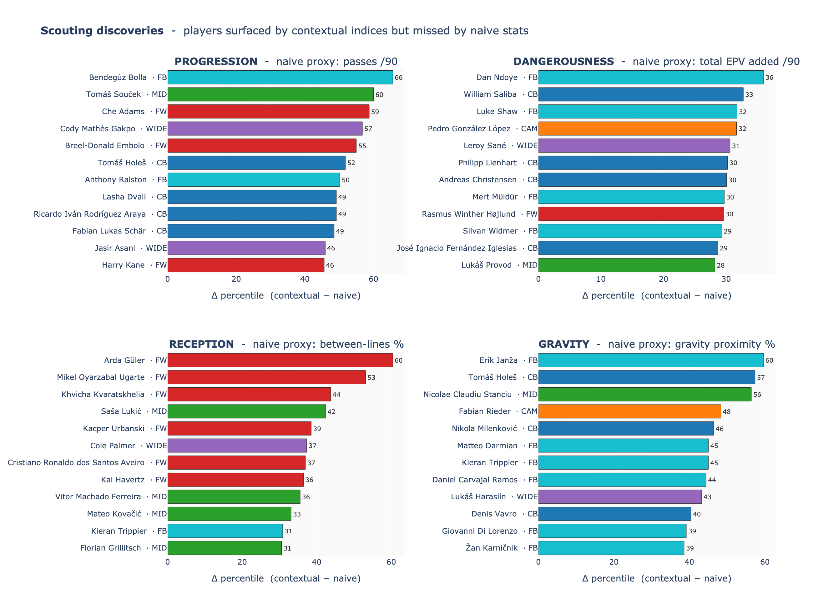
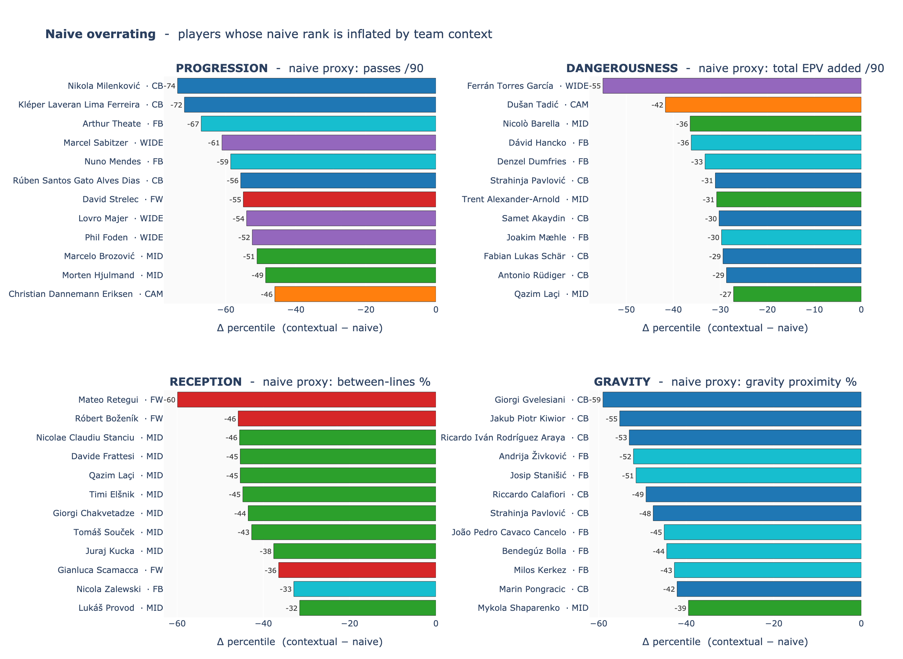

# H1 — Space Control and Value

Parte di **[Contextual Football Scouting](../README.md)** (Vezzoli & Mio, 2026). Per la cornice completa delle 4 ipotesi vedi [`docs/Project_Proposal.pdf`](../docs/Project_Proposal.pdf).

Implementazione di **Hypothesis 1** del progetto: un giocatore si misura dalla sua influenza spaziale sul campo, quantificata via convex hull del blocco avversario, line-breaker pesati per Expected Possession Value (EPV) e gravità sui difensori.

Costruito su **StatsBomb 360 open data** per UEFA Euro 2024 (`competition_id=55`, `season_id=282`, 51 partite, 272 giocatori dopo filtro minuti).

## I quattro indici

Ogni indice è la **media dei rank percentile within-role** delle sue mother variables (un CB è confrontato con altri CB).

- **PROGRESSION** — volume di gioco in avanti (5 variabili)
  `LB Geom /90` + `LB Quality /90` + `LB EPV /90` + `Hull Penetr. /90` + `Def. Bypassed Avg`
- **DANGEROUSNESS** — pericolosità creata (3 variabili)
  `EPV Added /90` + `EPV Penetr. /90` + `Circ. EPV /90` (EPV nei 18 m attorno alla porta)
- **RECEPTION** — gioco tra le linee e tecnica in spazi stretti (3 variabili)
  `Between Lines %` + `Hull Exits /90` + `Press. Resist %` (passaggi ricevuti con ≥ 2 avversari entro 2.5 m)
- **GRAVITY** — attrazione spaziale sui difensori (3 variabili)
  `Space Attraction %` + `Gravity Hull %` + `Def. Pull |m|` (spostamento del baricentro avversario, leave-one-out)

Glossario rapido: **convex hull** = poligono che racchiude i difensori avversari nel 360 frame; **line-breaker** = passaggio riuscito che bypassa ≥ 3 avversari in un corridoio di 5 m lungo la linea del passaggio; **EPV** = probabilità di segnare nelle prossime azioni dato dove sta la palla.

## Pipeline

```
StatsBomb events + 360 frames
        │
        ▼
  Player totals          ──►  Euro2024_Player_Totals_Distances_Roles.xlsx
        │
        ▼
  Hull Metrics           ──►  hull_events_raw.csv
                              hull_zone_baselines.csv
                              hull_metrics_aggregated.csv
        │
        ▼
  Directional Gravity         (estende hull_metrics_aggregated.csv)
        │
        ▼
  EPV Pipeline           ──►  hull_events_with_epv.csv  (open play only)
        │
        ▼
  Line Breaker           ──►  hull_events_lb.csv
        │
        ▼
  Player Aggregation     ──►  player_space_control_aggregated.csv
        │
        ▼
  Indices + Dashboard    ──►  player_space_control_indices.csv
        │                     (radar + leaderboard + scatter archetipi + top line-breakers)
        ▼
  Validation                  Cronbach's α + H1 evidence + scouting discoveries
```

## Risultati principali

**Validità interna (Cronbach's α, media sui 6 ruoli)**
| Indice | α medio | Lettura |
|---|---:|---|
| PROGRESSION | **0.77** | costrutto solido, le 5 variabili misurano la stessa dimensione |
| DANGEROUSNESS | **0.54** | accettabile per un indice multi-faccia |
| RECEPTION | **0.41** | composito, alto su CB e CAM, basso sui FW (sample piccolo) |
| GRAVITY | **−0.03** | costrutto **multi-direzionale**, le tre variabili catturano fenomeni diversi (atteso, non un difetto) |

Le quattro composite sono **poco correlate fra loro** (|r| ≤ 0.56 su tutto il pool, target < 0.6) → niente ridondanza.

**Test centrale di H1: contextual vs naive (within-role, n = 272)**

| Indice | Naive proxy | Spearman ρ | mean \|Δ\| | % \|Δ\| > 20 |
|---|---|---:|---:|---:|
| PROGRESSION | passes /90 | **0.47** | 21.7 | **47%** |
| DANGEROUSNESS | total EPV /90 | 0.84 | 12.7 | 21% |
| RECEPTION | between-lines % | 0.75 | 14.9 | 29% |
| GRAVITY | gravity proximity % | 0.60 | 18.5 | 39% |

Lettura: PROGRESSION è dove la differenza picchia di più — quasi un giocatore su due si sposta di oltre 20 punti percentile passando dal ranking naive a quello contestuale. Sui MID, top-15 naive (passes/90) e top-15 contextual (PROGRESSION) si sovrappongono solo per 10/15: **5 nomi nuovi** entrano (es. Trent Alexander-Arnold, Mateo Kovačić, Robert Andrich) e altrettanti escono.

### Scouting discoveries — chi emerge solo con il contesto


### Naive overrating — chi è gonfiato dal contesto squadra


## Folder structure

```
Space_Control_and_Value/
├── README.md
├── requirements.txt
├── .gitignore
│
├── notebooks/
│   └── H1-Space_Control_and_Value.ipynb       # notebook sottile: importa da src/ e mostra i risultati
│
├── docs/figures/                               # immagini usate da questo README
│
├── data/                                       # input + output della pipeline
│   ├── EPV_grid.csv                            # input: griglia EPV (Friends-of-Tracking-Data)
│   ├── Euro2024_Player_Totals_Distances_Roles.{csv,xlsx}
│   ├── hull_events_*.csv                       # intermediate (gitignored)
│   ├── hull_metrics_aggregated.csv
│   ├── hull_zone_baselines.csv
│   ├── player_space_control_aggregated.csv
│   ├── player_space_control_indices.csv        # output finale (4 idx + 14 percentili)
│   └── cache/                                  # StatsBomb 360-frame cache (gitignored)
│
└── src/
    ├── config.py                # paths, thresholds, role maps
    ├── geometry.py              # helper geometrici (hull, distance, corridor)
    ├── player_totals.py         # → totals .xlsx
    ├── hull_metrics.py          # → hull_metrics_aggregated.csv
    ├── directional_gravity.py   # estende hull_metrics_aggregated.csv
    ├── epv_pipeline.py          # → hull_events_with_epv.csv
    ├── line_breaker.py          # → hull_events_lb.csv
    ├── aggregation.py           # → player_space_control_aggregated.csv
    ├── indices.py               # 4 composite + within-role percentiles
    ├── dashboard.py             # 4 viste prototipo (radar / leaderboard / archetipi / top LB)
    └── validation.py            # Cronbach's α + H1 evidence + export finale
```

## Quick start

```bash
git clone https://github.com/ArMat-Analytics/Contextual-Football-Scouting
cd Contextual-Football-Scouting/Space_Control_and_Value
python -m venv .venv && source .venv/bin/activate
pip install -r requirements.txt

jupyter notebook notebooks/H1-Space_Control_and_Value.ipynb
```

Il notebook esegue la pipeline in ordine, una sezione per stage. Per girare un singolo stage da CLI:

```bash
python -m src.player_totals
python -m src.hull_metrics
python -m src.directional_gravity
python -m src.epv_pipeline
python -m src.line_breaker
python -m src.aggregation
```

I CSV intermedi sono committati per il path *analysis-only*: si può saltare direttamente alle celle di index design / validation / dashboard senza rieseguire le pipeline pesanti.

## Convenzioni

- **Coordinate**: campo in metri (105 × 68, standard UEFA). Le coordinate StatsBomb in yard sono convertite via `X_SCALE = 105/120`, `Y_SCALE = 68/80`.
- **Open play**: lo step EPV filtra corner, punizioni, rimesse e calci d'inizio. I rate downstream usano il subset open-play (`passes_op`).
- **Leave-one-out gravity**: la gravità di ogni giocatore è misurata contro una baseline che **esclude** i suoi stessi passaggi.
- **Within-role percentile**: ogni asse di ogni indice è il rank percentile del giocatore dentro il suo macro-ruolo (CB / FB / MID / CAM / WIDE / FW).
- **Min minutes**: 90 per entrare nel pool, 135 (= 1.5 partite) per le validation tables.

---

*Matteo Vezzoli & Armando Mio — 2026*
