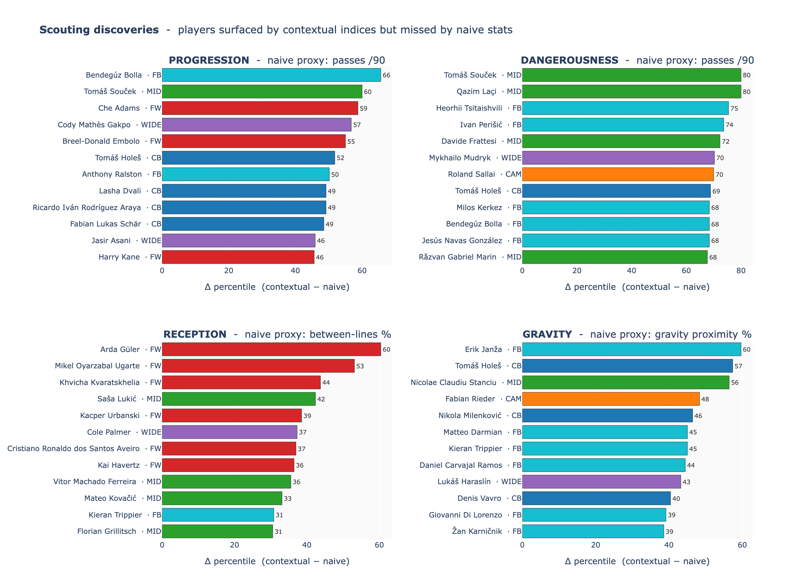
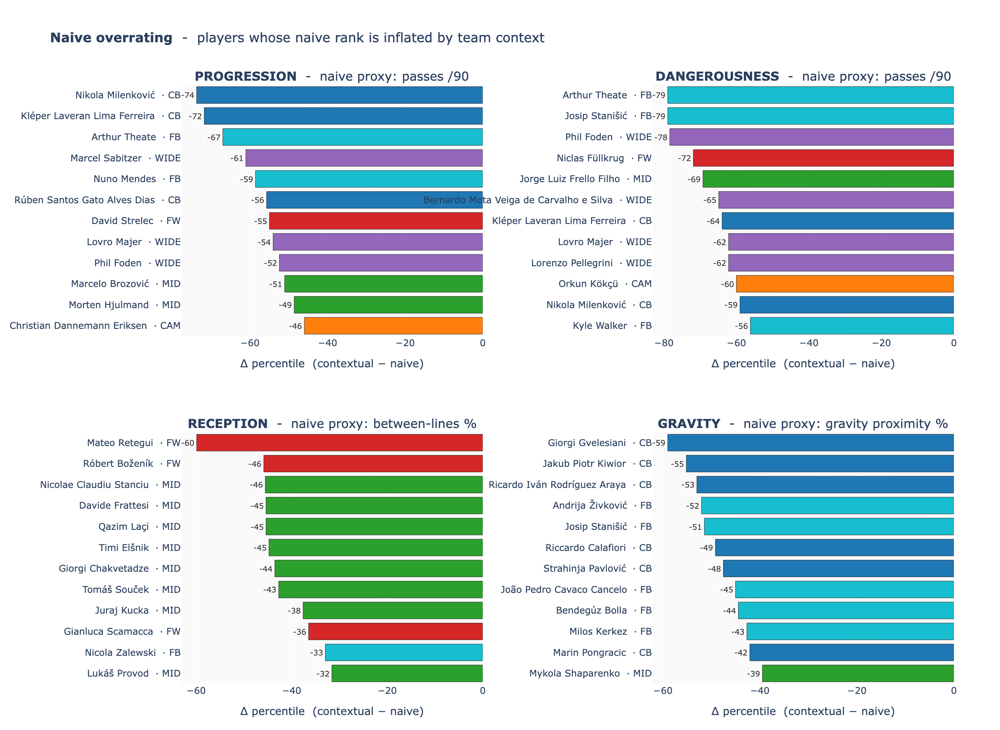

# H1 — Space Control and Value

Part of **[Contextual Football Scouting](../README.md)** (Vezzoli & Mio, 2026). For the full framing of the four hypotheses see [`docs/Project_Proposal.pdf`](../docs/Project_Proposal.pdf).

Implementation of **Hypothesis 1**: a player's quality is measurable through their spatial influence on the pitch, not their volume. We measure influence on three layers. The **shape** of the opposing block (convex hulls of the visible defenders), the **threat** added with each ball progression (Expected Possession Value), and the **pull** a player exerts on the defenders around them (gravity).

Built on **StatsBomb 360 open data** for UEFA Euro 2024 (`competition_id=55`, `season_id=282`, 51 matches, 272 players after the minutes filter).

## The four indices

Each index is the **mean of within-role percentile ranks** of its mother variables (a CB is benchmarked against other CBs, a CAM against other CAMs). Within-role percentiles are the heart of the approach: a centre-back ranked 90th on PROGRESSION is among the best 10% of *centre-backs* at progressing the ball, not the best 10% of the whole tournament.

Quick glossary: **convex hull** = polygon enclosing the visible opponents in the 360 frame; **line-breaker** = successful pass that bypasses ≥ 3 opponents inside a 5 m corridor along the pass line; **EPV** = probability of scoring in the next actions given the ball location.

### PROGRESSION, the volume of forward play

How often, and how cleanly, a player moves the ball through opponent lines. Mother variables (5):

`LB Geom /90` + `LB Quality /90` + `LB EPV /90` + `Hull Penetr. /90` + `Def. Bypassed Avg`

The first three count line-breakers under three lenses (geometric corridor, EPV threshold, the intersection of the two). `Hull Penetr. /90` is the volume of successful passes that *enter* the opposing block. `Def. Bypassed Avg` is the mean number of opponents removed from play per progressive pass. A player can score high here in two ways: by being a high-volume metronome (Kroos, Modrić) or by being a vertical specialist on lower volume (Alexander-Arnold).

### DANGEROUSNESS, threat creation in the final third

How much expected value a player generates in the 18 m around goal, on a per-90 basis. Mother variables (3):

`EPV Added /90` + `EPV Penetr. /90` + `Circ. EPV /90`

`EPV Added /90` is the per-90 sum of `epv_end − epv_start` on completed passes. `EPV Penetr. /90` isolates the same quantity on hull-penetrating passes only. `Circ. EPV /90` captures the EPV produced inside the 18 m circle around goal, the "danger zone" of every shot map. The signal here is closer to the public expected-assists narrative, by construction, so the H1 contextual vs naive gap is the smallest of the four.

### RECEPTION, between-the-lines play and tight-space technique

How often the player receives the ball *inside* the opposing block, and how often they survive when pressed. Mother variables (3):

`Between Lines %` + `Hull Exits /90` + `Press. Resist %`

`Between Lines %` is the share of touches taken inside the opponent convex hull. `Hull Exits /90` is the per-90 volume of clean ball-exits from inside the block. `Press. Resist %` is the completion rate when ≥ 2 opponents are within 2.5 m at the moment of release. This index is where Pedri, Wirtz and a cluster of ball-playing CBs (Calafiori, Matvienko, Krejčí) show up, because the signal is about *where you stand*, not how many touches you take.

### GRAVITY, the spatial pull on the defense

How much the opposing defenders move *because of you*. Mother variables (3):

`Space Attraction %` + `Gravity Hull %` + `Def. Pull |m|`

The first two summarise how often defenders sit in the player's neighbourhood relative to a leave-one-out baseline (the same `(match, zone)` baseline computed *without* that player's events). `Def. Pull |m|` is the absolute displacement, in meters, of the opposing defensive centroid toward the player. Gravity is the only index where Cronbach's α is negative, on purpose: a forward who pulls the centre-back wide and a winger who pins both full-backs inside are doing two *different* things, both legitimately "gravitational". The composite measures the union, not a single coherent skill.

## Pipeline

```
StatsBomb events + 360 frames
        │
        ▼
  Player totals          ──►  Euro2024_Player_Totals_Distances_Roles.xlsx
        │
        ▼
  Hull Metrics           ──►  hull_events_raw.csv
                              hull_zone_baselines.csv
                              hull_metrics_aggregated.csv
        │
        ▼
  Directional Gravity         (extends hull_metrics_aggregated.csv)
        │
        ▼
  EPV Pipeline           ──►  hull_events_with_epv.csv  (open play only)
        │
        ▼
  Line Breaker           ──►  hull_events_lb.csv
        │
        ▼
  Player Aggregation     ──►  player_space_control_aggregated.csv
        │
        ▼
  Indices + Dashboard    ──►  player_space_control_indices.csv
        │                     (radar + leaderboard + archetype scatter + top line-breakers)
        ▼
  Validation                  Cronbach's α + H1 evidence + scouting discoveries
```

## Website graphic: the 4-axis radar

The card on the site renders one **filled polygon per player**, one axis per index, all four oriented so outside is better. PROGRESSION, DANGEROUSNESS, RECEPTION and GRAVITY are already within-role percentiles, so no mirroring is needed. The two-player comparison page overlays two polygons (same macro-role only, the picker prevents cross-role duels upstream).

The reading of the shape is direct. A balanced polygon is a balanced player (Kroos on MIDs has a near-regular quadrilateral). A spike on DANGEROUSNESS with a low GRAVITY is a finisher who does not pull defenders (a poacher). A spike on RECEPTION with low PROGRESSION is a between-the-lines receiver who does not progress the ball himself (a classic 10 in a possession side). A spike on PROGRESSION with low DANGEROUSNESS is a deep-lying playmaker. The same logic applies in every role.

A **CORE STATS table** under the radar exposes the 14 within-role percentiles that *feed* the four axes, plus minutes, role, and the two annotations carried in the CSV (`gravity_composite_pct`, `gravity_directional_m`). The radar is the headline, the table is the diagnostic.

## Key findings

A scout-first read of the Euro 2024 leaderboards on the four indices, with the minutes floor at 135' (≈ 1.5 matches). The interesting names show up not at the very top of "volume" stats but inside their own role pool, where the within-role percentile lives.

### PROGRESSION, recognised and surprising

- **Trent Alexander-Arnold** (England, MID, n=135') tops the index at 95th, on the smallest sample of the leaders. He played a hybrid inverted role at Euro 2024 and the metric reads exactly that: high LB EPV volume and high `Def. Bypassed Avg`, even on short minutes.
- **Toni Kroos** (Germany, MID) at 93rd on 485 minutes is the metronome answer. Highest sample of any midfield leader on this index.
- **Luka Modrić** (Croatia, MID) at 94th and **Mateo Kovačić** (Croatia, MID) at 92nd, both at the top of the role pool, the Croatian double pivot reads as a progression duo where the naive view tends to credit only Modrić.
- **Alessandro Bastoni** (Italy, CB) and **Joachim Andersen** (Denmark, CB) at 94th and 92nd among CBs, two ball-playing centre-backs whose `LB EPV /90` is comparable to that of central midfielders.
- **Bruno Fernandes** (Portugal, MID, n=379) at 90th, lower than the public reputation on his "passing" because the volume of safe passes deflates `LB Quality /90`.

### DANGEROUSNESS, where naive and contextual agree the most

This is the index closest to the public expected-assists narrative, so the top is full of recognised names. **Arda Güler** (Turkey, FW, n=369), **Bruno Fernandes** (Portugal, MID), **Antonio Rüdiger** (Germany, CB, n=488 minutes) and **Joachim Andersen** (Denmark, CB) all sit at 98–100 inside their role. Rüdiger at the top of the CB role on this index is the kind of finding the naive view never produces, the role pool puts his per-90 EPV contribution on a level no other CB matches.

A counter-intuitive read in this group is **Phil Foden** (England, WIDE), 11th on DANGEROUSNESS. His EPV contribution per 90 is genuinely modest in the Euro 2024 sample, the naive view ranks him much higher because of touches and shot volume, not value-added.

### RECEPTION, the between-the-lines fingerprint

- **Pedri** (Spain, CAM, n=185') at 98th. The clearest "between-the-lines" CAM of the tournament, with the highest `Between Lines %` of any CAM and very strong `Press. Resist %`.
- **Florian Wirtz** (Germany, WIDE) at 90th, the highest of the WIDE pool. Wide attackers normally score low here because they receive on the touchline, Wirtz is the exception because he comes inside.
- **Riccardo Calafiori** (Italy, CB), **Mykola Matvienko** (Ukraine, CB), **Ladislav Krejčí** (Czech Rep, CB), **Willi Orban** (Hungary, CB), **Nacho Fernández** (Spain, CB), a cluster of ball-playing centre-backs at 88–93 on a role pool that traditionally scores low. The signal is `Press. Resist %`, these CBs survive 2 m pressure at midfielder-level rates.
- **Breel Embolo** (Switzerland, FW) at 89th, a centre-forward whose between-the-lines reception rate beats most CAMs. Reads as the modern "drop nine" profile.

### GRAVITY, the names volume never surfaces

This is the index where the H1 contextual approach is most distinct from anything in the public sphere. The top is dominated by players from smaller national teams, because gravity is about *the defenders' response*, not about ball volume.

- **Jan Mlakar** (Slovenia, WIDE) at 95th. The leader of the gravity index. Slovenia's whole attack pivoted around him, the defensive centroid of opponents shifts toward Mlakar more than for any other Euro 2024 player on a meaningful sample.
- **Giorgi Kochorashvili** (Georgia, MID) at 93rd, **Lukáš Provod** (Czech Rep, MID) at 92nd, **Salih Özcan** (Turkey, MID) at 92nd. A trio of midfielders from sides that played one-reference football, the metric reads the *team* structure through them.
- **David Strelec** (Slovakia, FW) at 92nd, the only FW in the top of the index. Slovakia's centroid collapsed onto him whenever Slovakia broke into the final third.
- **Kenan Yildiz** (Turkey, WIDE) at 84th, a more "household" name in this group.

A separate finding sits in the famous-names column. **Joshua Kimmich** (Germany, FB) at 83rd PROGRESSION, 96th DANGEROUSNESS, 72nd RECEPTION, 57th GRAVITY. A profile that confirms the public reading on the offensive side but suggests his gravitational pull is mid-pool inside the FB role.

### Contextual vs naive, the headline H1 test

**Internal validity (Cronbach's α, averaged over the 6 roles)**

| Index | Mean α | Reading |
|---|---:|---|
| PROGRESSION | **0.77** | tight construct, the 5 variables measure the same dimension |
| DANGEROUSNESS | **0.54** | acceptable for a multi-faceted index |
| RECEPTION | **0.41** | composite, high on CB and CAM, low on FW (small sample) |
| GRAVITY | **−0.03** | **multi-directional** construct, the three variables capture different phenomena (expected, not a flaw) |

The four composites are **weakly correlated with each other** (|r| ≤ 0.56 across the full pool, target < 0.6), so no redundancy.

**Core H1 test: contextual vs naive (within-role, n = 272)**

| Index | Naive proxy | Spearman ρ | mean \|Δ\| | % \|Δ\| > 20 |
|---|---|---:|---:|---:|
| PROGRESSION | passes /90 | **0.47** | 21.7 | **47%** |
| DANGEROUSNESS | total EPV /90 | 0.84 | 12.7 | 21% |
| RECEPTION | between-lines % | 0.75 | 14.9 | 29% |
| GRAVITY | gravity proximity % | 0.60 | 18.5 | 39% |

Reading: PROGRESSION is where the gap hits hardest. Almost one player in two shifts by more than 20 percentile points moving from the naive ranking to the contextual one. For MIDs, the naive top-15 (passes/90) and the contextual top-15 (PROGRESSION) overlap on only 10/15. **Five new names** enter (Trent Alexander-Arnold, Mateo Kovačić, Robert Andrich and two others) and as many drop out.

### Scouting discoveries, players surfaced only by context



The chart shows, per index, the players whose contextual percentile is dramatically higher than their naive percentile. Read it role by role, not across the whole pitch.

### Naive overrating, players inflated by team context



The mirror chart. Players whose naive view sits well above their contextual ranking. Often passes-volume midfielders in possession sides whose 90 minutes of safe circulation inflate the naive ranking without adding line-breaking value.

## Folder structure

```
Space_Control_and_Value/
├── README.md
├── requirements.txt
├── .gitignore
│
├── notebooks/
│   └── H1-Space_Control_and_Value.ipynb       # thin notebook: imports from src/ and shows results
│
├── docs/figures/                               # images used by this README
│
├── data/                                       # pipeline inputs and outputs
│   ├── EPV_grid.csv                            # input: EPV grid (Friends-of-Tracking-Data)
│   ├── Euro2024_Player_Totals_Distances_Roles.{csv,xlsx}
│   ├── hull_events_*.csv                       # intermediates (gitignored)
│   ├── hull_metrics_aggregated.csv
│   ├── hull_zone_baselines.csv
│   ├── player_space_control_aggregated.csv
│   ├── player_space_control_indices.csv        # final output (4 indices + 14 percentiles)
│   └── cache/                                   # StatsBomb 360-frame cache (gitignored)
│
└── src/
    ├── config.py                # paths, thresholds, role maps
    ├── geometry.py              # geometric helpers (hull, distance, corridor)
    ├── player_totals.py         # → totals .xlsx
    ├── hull_metrics.py          # → hull_metrics_aggregated.csv
    ├── directional_gravity.py   # extends hull_metrics_aggregated.csv
    ├── epv_pipeline.py          # → hull_events_with_epv.csv
    ├── line_breaker.py          # → hull_events_lb.csv
    ├── aggregation.py           # → player_space_control_aggregated.csv
    ├── indices.py               # 4 composites + within-role percentiles
    ├── dashboard.py             # 4 prototype views (radar / leaderboard / archetypes / top LB)
    └── validation.py            # Cronbach's α + H1 evidence + final export
```

## Quick start

```bash
git clone https://github.com/ArMat-Analytics/Contextual-Football-Scouting
cd Contextual-Football-Scouting/Space_Control_and_Value
python -m venv .venv && source .venv/bin/activate
pip install -r requirements.txt

jupyter notebook notebooks/H1-Space_Control_and_Value.ipynb
```

The notebook runs the pipeline in order, one section per stage. To run a single stage from the CLI:

```bash
python -m src.player_totals
python -m src.hull_metrics
python -m src.directional_gravity
python -m src.epv_pipeline
python -m src.line_breaker
python -m src.aggregation
```

The intermediate CSVs are committed for the *analysis-only* path: you can jump straight to the index design / validation / dashboard cells without re-running the heavy pipelines.

## Conventions

- **Coordinates**: pitch in meters (105 × 68, UEFA standard). StatsBomb yard coordinates are converted via `X_SCALE = 105/120`, `Y_SCALE = 68/80`.
- **Open play**: the EPV step filters out corners, free kicks, throw-ins and kick-offs. Downstream rates use the open-play subset (`passes_op`).
- **Leave-one-out gravity**: each player's gravity is measured against a baseline that **excludes** their own passes.
- **Within-role percentiles**: every axis of every index is the player's percentile rank inside their macro-role (CB / FB / MID / CAM / WIDE / FW).
- **Min minutes**: 90 to enter the pool, 135 (= 1.5 matches) for the validation tables.

---

*Matteo Vezzoli & Armando Mio — 2026*
